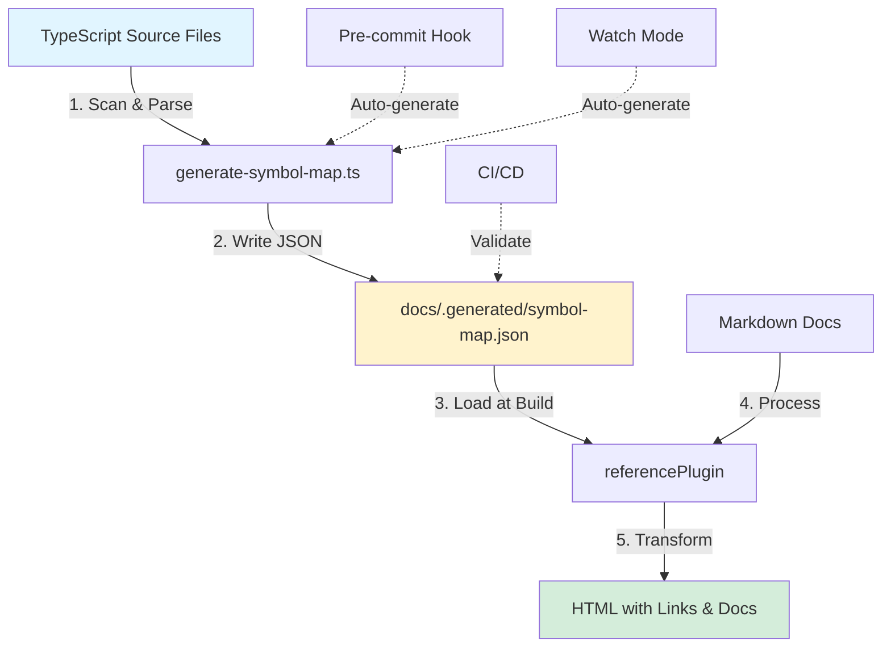

# Architecture: Package & Consumer Split

The docs-engine symbol reference system is deliberately split between reusable package functionality and consumer-specific implementation. This architecture enables any project to adopt the system while maintaining flexibility for project-specific needs.

This guide explains what belongs in the package versus consuming repositories, how they interact, and how to integrate the system into new projects.

## Table of Contents

- [Design Philosophy](#design-philosophy)
- [Package Responsibilities](#package-responsibilities)
- [Consumer Responsibilities](#consumer-responsibilities)
- [Data Flow](#data-flow)
- [Integration Guide](#integration-guide)
- [Configuration Options](#configuration-options)
- [API Reference](#api-reference)
- [Extension Points](#extension-points)
- [Real-World Examples](#real-world-examples)
- [Design Decisions](#design-decisions)
- [Migration Guide](#migration-guide)
- [Troubleshooting](#troubleshooting)
- [Contributing](#contributing)

> [!TIP]
> Visual learner? Check out the **[Architecture Diagrams](./DIAGRAMS.md)** for flowcharts and system overviews.

## Design Philosophy

The symbol reference system follows a **generation-consumption split**:

1. **Generation** (consumer): Project-specific scripts scan TypeScript files and generate `symbol-map.json`
2. **Consumption** (package): Generic remark plugins read the symbol map and transform markdown

This separation provides:

- **Flexibility**: Each project controls what symbols to capture and how to scan for them
- **Simplicity**: Package remains lightweight and focused on markdown transformation
- **Customization**: Easy to adapt to different project structures, monorepos, or special requirements
- **Performance**: Symbol generation can be optimized per-project (caching, incremental builds)

> [!NOTE]
> The package is stateless at build time—it simply reads pre-generated JSON. This makes it fast, predictable, and easy to debug.

## Package Responsibilities

The `@goobits/docs-engine` package provides **reusable transformation logic** that works with any project:

### Core Plugins

Located in `src/lib/plugins/`:

- **`reference.ts`** - Remark plugin that transforms `{@Symbol}` and `:::reference` syntax
- **`links.ts`** - Converts relative markdown links to absolute paths
- **`callouts.ts`** - Renders note/warning/info boxes
- **`mermaid.ts`** - Diagram rendering
- **`tabs.ts`** - Tabbed code examples
- **`toc.ts`** - Table of contents generation
- **`screenshot.ts`** - Screenshot embedding
- **`filetree.ts`** - Interactive file trees

### Symbol Resolution Logic

Located in `src/lib/utils/`:

- **`symbol-resolver.ts`** - Core resolution logic:
  - Load `symbol-map.json` from various paths
  - Resolve symbol references (with path hints for disambiguation)
  - Handle ambiguous symbols with helpful error messages
  - Fuzzy matching for typos (Levenshtein distance)

- **`symbol-renderer.ts`** - Rendering utilities:
  - Inline rendering (links with tooltips)
  - Block rendering (full API documentation)
  - GitHub URL generation
  - HTML sanitization

### Type Definitions

```typescript
// Core interfaces exported by the package
export interface SymbolDefinition {
  name: string;
  path: string;
  line: number;
  kind: 'type' | 'interface' | 'class' | 'function' | 'enum' | 'const';
  exported: boolean;
  jsDoc?: {
    description?: string;
    params?: Array<{ name: string; description: string; type: string }>;
    returns?: string;
    example?: string;
  };
  signature: string;
}

export interface SymbolMap {
  [symbolName: string]: SymbolDefinition[];
}
```

### Plugin Configuration

```typescript
export interface ReferencePluginOptions {
  // Future: strictMode, customSymbolMap path, etc.
}

export interface RenderOptions {
  show?: Array<'signature' | 'description' | 'params' | 'returns' | 'example'>;
}
```

### What the Package Does NOT Include

- ❌ Symbol generation scripts (project-specific)
- ❌ TypeScript parsing logic (consumer implements)
- ❌ Pre-commit hooks (consumer configures)
- ❌ CI/CD workflows (consumer sets up)
- ❌ Directory scanning patterns (consumer defines)
- ❌ Watch mode for auto-regeneration (consumer implements)

## Consumer Responsibilities

Projects using `@goobits/docs-engine` must implement **symbol generation and automation**:

### 1. Symbol Generation Script

Create a script to scan TypeScript files and generate `symbol-map.json`.

**Example: `scripts/docs/generate-symbol-map.ts`**

```typescript
import * as ts from 'typescript';
import { glob } from 'glob';
import fs from 'fs';

const SOURCE_PATTERNS = [
  'src/**/*.ts',
  '../packages/shared/src/**/*.ts',
];

const EXCLUDE_PATTERNS = [
  '**/*.test.ts',
  '**/node_modules/**',
  '**/dist/**',
];

async function generateSymbolMap() {
  const symbolMap: Record<string, SymbolDefinition[]> = {};

  // Find all TypeScript files
  const files = await glob(SOURCE_PATTERNS, {
    ignore: EXCLUDE_PATTERNS,
  });

  // Parse each file with TypeScript compiler
  for (const file of files) {
    const sourceCode = fs.readFileSync(file, 'utf-8');
    const sourceFile = ts.createSourceFile(
      file,
      sourceCode,
      ts.ScriptTarget.Latest,
      true
    );

    // Visit AST nodes and extract exported symbols
    function visit(node: ts.Node) {
      const hasExport = node.modifiers?.some(
        m => m.kind === ts.SyntaxKind.ExportKeyword
      );

      if (hasExport) {
        // Extract symbol information
        const symbol = extractSymbol(node, sourceFile);
        if (symbol) {
          if (!symbolMap[symbol.name]) {
            symbolMap[symbol.name] = [];
          }
          symbolMap[symbol.name].push(symbol);
        }
      }

      ts.forEachChild(node, visit);
    }

    visit(sourceFile);
  }

  // Write to docs/.generated/symbol-map.json
  fs.mkdirSync('docs/.generated', { recursive: true });
  fs.writeFileSync(
    'docs/.generated/symbol-map.json',
    JSON.stringify(symbolMap, null, 2)
  );
}

generateSymbolMap();
```

### 2. Build Integration

Add scripts to `package.json`:

```json
{
  "scripts": {
    "docs:symbols": "tsx scripts/docs/generate-symbol-map.ts",
    "docs:symbols:watch": "tsx scripts/docs/watch-symbols.ts",
    "docs:build": "pnpm docs:symbols && pnpm build",
    "prebuild": "pnpm docs:symbols"
  }
}
```

### 3. Pre-Commit Hook (Optional)

Ensure symbol map stays in sync with code changes:

**.husky/pre-commit**
```bash
#!/bin/sh
pnpm docs:symbols

# Stage the generated symbol map if it changed
git add docs/.generated/symbol-map.json
```

### 4. CI/CD Integration (Optional)

**GitHub Actions Workflow**

```yaml
name: Docs
on: [push, pull_request]

jobs:
  validate-docs:
    runs-on: ubuntu-latest
    steps:
      - uses: actions/checkout@v3
      - uses: pnpm/action-setup@v2
      - uses: actions/setup-node@v3
        with:
          node-version: 20
          cache: 'pnpm'

      - name: Install dependencies
        run: pnpm install

      - name: Generate symbol map
        run: pnpm docs:symbols

      - name: Check for uncommitted changes
        run: |
          git diff --exit-code docs/.generated/symbol-map.json || {
            echo "Error: symbol-map.json is out of sync"
            echo "Run 'pnpm docs:symbols' and commit the changes"
            exit 1
          }
```

### 5. Watch Mode for Development (Optional)

For a better DX during documentation writing:

**`scripts/docs/watch-symbols.ts`**

```typescript
import chokidar from 'chokidar';
import { spawn } from 'child_process';

const watcher = chokidar.watch('src/**/*.ts', {
  ignored: ['**/*.test.ts', '**/node_modules/**'],
  persistent: true,
});

let debounceTimer: NodeJS.Timeout | null = null;

watcher.on('change', (path) => {
  console.log(`File changed: ${path}`);

  if (debounceTimer) clearTimeout(debounceTimer);

  debounceTimer = setTimeout(() => {
    console.log('Regenerating symbol map...');
    spawn('tsx', ['scripts/docs/generate-symbol-map.ts'], {
      stdio: 'inherit',
    });
  }, 500);
});

console.log('Watching TypeScript files for changes...');
```

### 6. Plugin Configuration

Add `referencePlugin` to your `svelte.config.js` or `mdsvex.config.js`:

```javascript
import { mdsvex } from 'mdsvex';
import { referencePlugin } from '@goobits/docs-engine/plugins';

export default {
  extensions: ['.svelte', '.md'],
  preprocess: [
    mdsvex({
      remarkPlugins: [
        referencePlugin(), // Must come after linksPlugin
        // ... other plugins
      ],
    }),
  ],
};
```

## Data Flow



### Processing Pipeline

1. **Symbol Generation** (Consumer)
   - TypeScript files are parsed with `ts.createSourceFile()`
   - AST is traversed to find exported declarations
   - Symbol metadata is extracted (name, path, line, kind, JSDoc)
   - Results are written to `symbol-map.json`

2. **Build Time** (Package)
   - Remark plugin loads `symbol-map.json`
   - Markdown is parsed by mdsvex
   - `{@Symbol}` references are resolved using the symbol map
   - Path hints are used to disambiguate when needed
   - Links and tooltips are generated

3. **Runtime** (Browser)
   - Static HTML with links is served
   - Symbol references link to GitHub source
   - Tooltips show type signatures on hover

## Integration Guide

### Step 1: Install Package

```bash
pnpm add @goobits/docs-engine
```

### Step 2: Create Symbol Generation Script

Copy the template from [Consumer Responsibilities](#1-symbol-generation-script) and customize:

- Adjust `SOURCE_PATTERNS` to match your project structure
- Add any custom symbol kinds you need
- Configure output path (`docs/.generated/symbol-map.json`)

### Step 3: Configure Plugins

Add to `svelte.config.js`:

```javascript
import { referencePlugin } from '@goobits/docs-engine/plugins';

export default {
  preprocess: [
    mdsvex({
      remarkPlugins: [
        referencePlugin(),
      ],
    }),
  ],
};
```

### Step 4: Generate Symbol Map

```bash
pnpm docs:symbols
```

Verify output at `docs/.generated/symbol-map.json`.

### Step 5: Use in Documentation

```markdown
# API Documentation

The {@RequestState} type tracks the current request context.

For session management, see {@SessionState} or {@types#SessionState} if disambiguation is needed.

## Full API Reference

:::reference RequestState
:::
```

### Step 6: Automate (Optional)

Set up pre-commit hooks, CI validation, and watch mode as needed.

## Configuration Options

### Symbol Generation

**Source Patterns**

```typescript
const SOURCE_PATTERNS = [
  'src/lib/**/*.ts',          // Main library code
  'src/server/**/*.ts',       // Server-side code
  '../packages/shared/**/*.ts', // Monorepo packages
];
```

**Exclude Patterns**

```typescript
const EXCLUDE_PATTERNS = [
  '**/*.test.ts',
  '**/*.spec.ts',
  '**/__tests__/**',
  '**/node_modules/**',
  '**/dist/**',
];
```

**Symbol Kinds**

```typescript
// Captured by default
type SymbolKind =
  | 'type'       // type Foo = ...
  | 'interface'  // interface Bar { ... }
  | 'class'      // class Baz { ... }
  | 'function'   // function qux() { ... }
  | 'enum'       // enum Status { ... }
  | 'const';     // const FOO = ...
```

**Output Location**

```typescript
const OUTPUT_PATH = 'docs/.generated/symbol-map.json';
```

### Plugin Options

**Reference Plugin**

```typescript
referencePlugin({
  // Future options:
  // strictMode: true,     // Fail build on missing symbols
  // symbolMapPath: '...',  // Custom symbol map location
})
```

**Render Options**

```markdown
:::reference RequestState
show: signature,description,params
:::
```

Available fields: `signature`, `description`, `params`, `returns`, `example`

### Caching

Implement caching in your generation script for faster rebuilds:

```typescript
interface CacheEntry {
  mtime: number;
  hash: string;
  symbols: SymbolDefinition[];
}

function loadCache(): Record<string, CacheEntry> {
  // Load from .dev/tmp/symbol-cache.json
}

function hasFileChanged(file: string, cached: CacheEntry): boolean {
  // Compare mtime and content hash
}
```

## API Reference

### From `@goobits/docs-engine/plugins`

```typescript
import { referencePlugin } from '@goobits/docs-engine/plugins';

// Remark plugin for transforming symbol references
referencePlugin(options?: ReferencePluginOptions): Plugin
```

### From `@goobits/docs-engine/utils`

```typescript
import {
  loadSymbolMap,
  resolveSymbol,
  symbolToGitHubUrl,
  AmbiguousSymbolError,
  type SymbolDefinition,
  type SymbolMap,
} from '@goobits/docs-engine/utils';

// Load symbol map from disk (with caching)
function loadSymbolMap(): SymbolMap;

// Resolve a symbol reference to its definition
function resolveSymbol(
  reference: string,  // e.g., "RequestState" or "types#RequestState"
  symbolMap: SymbolMap
): SymbolDefinition;

// Convert symbol to GitHub source URL
function symbolToGitHubUrl(symbol: SymbolDefinition): string;

// Error thrown when symbol is ambiguous or not found
class AmbiguousSymbolError extends Error {
  constructor(
    symbolName: string,
    candidates: SymbolDefinition[] | string[],
    pathHint?: string,
    customMessage?: string
  );
}
```

### From `@goobits/docs-engine/utils` (Rendering)

```typescript
import {
  renderInline,
  renderBlock,
  type RenderOptions,
} from '@goobits/docs-engine/utils';

// Render inline reference as link with tooltip
function renderInline(symbol: SymbolDefinition): string;

// Render block reference as full API documentation
function renderBlock(
  symbol: SymbolDefinition,
  options?: RenderOptions
): string;

interface RenderOptions {
  show?: Array<'signature' | 'description' | 'params' | 'returns' | 'example'>;
}
```

## Extension Points

### Custom Symbol Kinds

Add custom kinds to your generation script:

```typescript
interface CustomSymbolDefinition extends SymbolDefinition {
  kind: 'type' | 'interface' | 'class' | 'function' | 'enum' | 'const' | 'component' | 'hook';
}

// Extract Svelte components
if (filePath.endsWith('.svelte')) {
  const componentName = path.basename(filePath, '.svelte');
  symbolMap[componentName] = [{
    name: componentName,
    path: filePath,
    line: 1,
    kind: 'component',
    exported: true,
    signature: `<${componentName} />`,
  }];
}
```

### Custom Path Hint Resolution

Override path hint matching in your fork:

```typescript
// In symbol-resolver.ts
function matchesPathHint(symbol: SymbolDefinition, hint: string): boolean {
  // Custom logic: e.g., match package names
  if (hint.startsWith('@')) {
    return symbol.path.includes(`packages/${hint}/`);
  }
  return symbol.path.includes(hint);
}
```

### Custom GitHub URL Generation

Customize GitHub URL format:

```typescript
// In symbol-renderer.ts
export function symbolToGitHubUrl(symbol: SymbolDefinition): string {
  // Custom logic for monorepos, private repos, etc.
  const repoPath = symbol.path.startsWith('../')
    ? symbol.path.replace(/^\.\.\//, '')
    : `web/${symbol.path}`;

  return `https://github.com/your-org/your-repo/blob/main/${repoPath}#L${symbol.line}`;
}
```

### Custom Error Handling

Handle missing symbols gracefully:

```typescript
referencePlugin({
  onError: (error: AmbiguousSymbolError, reference: string) => {
    // Custom error handling
    console.warn(`Failed to resolve {@${reference}}: ${error.message}`);

    // Return fallback content
    return `<code>${reference}</code> <span class="error">(not found)</span>`;
  },
});
```

## Real-World Examples

### Spacebase (Monorepo)

**Structure:**
```
spacebase/
├── web/
│   ├── src/lib/server/     # Server-side code
│   ├── src/lib/shared/     # Shared utilities
│   └── scripts/docs/
│       └── generate-symbol-map.ts
├── packages/
│   ├── shared/             # Cross-package types
│   └── @goobits/
│       ├── docs-engine/
│       └── forms/
└── docs/
    ├── .generated/
    │   └── symbol-map.json
    └── reference/
        └── api.md
```

**Generation Script:**
```typescript
const SOURCE_PATTERNS = [
  'src/lib/server/**/*.ts',
  'src/lib/shared/**/*.ts',
  '../packages/shared/src/**/*.ts',
];

// Outputs to: ../docs/.generated/symbol-map.json
```

**Usage in Docs:**
```markdown
# Workflow API

The {@WorkflowState} type tracks orchestrator state.

For Jules integration, see {@implementors/types#SessionState}.

:::reference WorkflowState
:::
```

**Disambiguation:**
- `{@SessionState}` - ambiguous (2 matches)
- `{@implementors/types#SessionState}` - specific (1 match)

### Minimal Single-Package Example

**Structure:**
```
my-lib/
├── src/
│   ├── index.ts
│   └── utils.ts
├── scripts/
│   └── generate-symbols.ts
└── docs/
    ├── .generated/
    │   └── symbol-map.json
    └── api.md
```

**Simple Generation:**
```typescript
import * as ts from 'typescript';
import fs from 'fs';

const files = ['src/index.ts', 'src/utils.ts'];
const symbolMap: Record<string, SymbolDefinition[]> = {};

for (const file of files) {
  const code = fs.readFileSync(file, 'utf-8');
  const source = ts.createSourceFile(file, code, ts.ScriptTarget.Latest);

  // Extract exported symbols...
}

fs.writeFileSync(
  'docs/.generated/symbol-map.json',
  JSON.stringify(symbolMap, null, 2)
);
```

**Usage:**
```markdown
# API

{@parseConfig} parses the configuration file.
```

### Advanced Custom Features

**Custom Symbol Metadata:**

```typescript
interface ExtendedSymbolDefinition extends SymbolDefinition {
  deprecated?: boolean;
  since?: string;
  tags?: string[];
}

// In generation script
if (jsDoc.tags?.find(t => t.tagName.text === 'deprecated')) {
  symbol.deprecated = true;
}

if (jsDoc.tags?.find(t => t.tagName.text === 'since')) {
  symbol.since = jsDoc.tags.find(t => t.tagName.text === 'since').comment;
}
```

**Custom Rendering:**

```markdown
:::reference MyComponent
show: signature,description
deprecated: true
:::
```

## Design Decisions

### Why Separate Generation from Rendering?

**Pros:**
- ✅ Package remains lightweight and focused
- ✅ Each project controls symbol extraction logic
- ✅ Easy to optimize generation (caching, incremental)
- ✅ No coupling to TypeScript version
- ✅ Works with any source language (not just TS)

**Cons:**
- ❌ More setup required per project
- ❌ Symbol map can go out of sync

**Verdict:** The flexibility and simplicity outweigh the setup cost. Most projects only need to configure generation once.

### Why Not Include Generation in Package?

**Considered Alternatives:**

1. **Bundle TypeScript parser in package**
   - Con: Heavy dependency (TypeScript is 60MB+)
   - Con: Requires matching user's TS version
   - Con: Hard to customize per project

2. **Use TypeDoc programmatic API**
   - Con: TypeDoc is complex and opinionated
   - Con: Slow on large codebases
   - Con: Hard to customize output format

3. **Provide CLI tool in package**
   - Pro: Easier to get started
   - Con: Still requires configuration
   - Con: One-size-fits-all approach doesn't work

**Decision:** Provide example scripts and let projects customize. Better DX in the long run.

### Why JSON Symbol Map?

**Alternatives Considered:**

1. **Database (SQLite)**
   - Con: Requires runtime dependencies
   - Con: Harder to version control
   - Con: More complex setup

2. **In-memory only**
   - Con: Slow builds (re-parse every time)
   - Con: Can't cache between processes

3. **Binary format**
   - Con: Not human-readable
   - Con: Hard to debug

**Decision:** JSON provides the best balance of simplicity, debuggability, and version control.

### Why Load Symbol Map at Build Time?

**Alternative:** Generate symbols at runtime (on-demand)

**Problems:**
- Requires access to source files at runtime
- Slow initial page load
- Complex server-side caching
- Doesn't work with static site generation

**Decision:** Pre-generate at build time. Symbols are static—no need for runtime generation.

## Migration Guide

### From Manual Links to Symbol References

**Before:**
```markdown
See the [RequestState](https://github.com/org/repo/blob/main/src/types.ts#L42) type.
```

**After:**
```markdown
See the {@RequestState} type.
```

### From TypeDoc to Symbol Map

**Before:**
```markdown
<!-- TypeDoc generates per-symbol pages -->
See [RequestState](./api/modules/types.html#RequestState).
```

**After:**
```markdown
<!-- Link to source, show docs inline -->
See {@RequestState}.

:::reference RequestState
:::
```

### Gradual Adoption Strategy

1. **Phase 1:** Set up generation script, generate symbol map
2. **Phase 2:** Add plugin to mdsvex config (doesn't break existing docs)
3. **Phase 3:** Convert high-traffic pages to use `{@Symbol}` syntax
4. **Phase 4:** Update remaining docs as you touch them

> [!NOTE]
> The plugin is non-breaking. Existing markdown links continue to work.

## Troubleshooting

### Symbol Not Found

**Error:**
```
Symbol "Foo" not found.

Did you mean one of these?
  - {@FooBar}
  - {@FooBaz}
```

**Solutions:**
1. Run `pnpm docs:symbols` to regenerate the symbol map
2. Check if the symbol is exported (`export type Foo`)
3. Verify the file is included in `SOURCE_PATTERNS`
4. Check if the file is excluded by `EXCLUDE_PATTERNS`

### Ambiguous Symbol

**Error:**
```
Symbol "SessionState" is ambiguous (2 matches).

Use a path hint to disambiguate:
  - {@implementors/types#SessionState}  // src/lib/server/implementors/types.ts
  - {@types#SessionState}                // src/lib/shared/types.ts
```

**Solution:**
Use a path hint: `{@implementors/types#SessionState}`

### Cache Issues

**Symptom:** Symbol map not updating after code changes

**Solution:**
```bash
# Clear cache
rm .dev/tmp/symbol-cache.json

# Regenerate
pnpm docs:symbols
```

### Performance Optimization

**Problem:** Symbol generation is slow on large codebases

**Solutions:**

1. **Implement caching** (see [Configuration Options](#caching))
2. **Use incremental generation** (only process changed files)
3. **Exclude unnecessary directories**
4. **Run in parallel** (use worker threads)

Example benchmark (Spacebase monorepo):
- Without cache: 8.2s (327 files)
- With cache (100% hit): 1.1s
- With cache (50% hit): 4.5s

### Module Resolution Errors

**Error:**
```
Error: Cannot find module '@goobits/docs-engine/utils'
```

**Solution:**
Ensure TypeScript can resolve package exports. Add to `tsconfig.json`:

```json
{
  "compilerOptions": {
    "moduleResolution": "bundler",
    "resolvePackageJsonExports": true
  }
}
```

## Contributing

### Package Maintainers

**What belongs in the package:**
- Core transformation logic (plugins)
- Symbol resolution algorithm
- Rendering utilities
- Type definitions
- Documentation

**What does NOT belong:**
- Project-specific generation scripts
- Pre-commit hooks
- CI/CD workflows

### Breaking Change Policy

**Semantic Versioning:**
- **Major (1.0.0 → 2.0.0)**: Breaking API changes (plugin interface, SymbolDefinition structure)
- **Minor (1.0.0 → 1.1.0)**: New features (new symbol kinds, render options)
- **Patch (1.0.0 → 1.0.1)**: Bug fixes, documentation

**Deprecation Process:**
1. Add deprecation warning in current version
2. Document migration path
3. Remove in next major version

### Testing Requirements

**Package Tests:**
- Unit tests for symbol resolution
- Integration tests for plugins
- Snapshot tests for rendered output

**Consumer Tests:**
- Validate generated symbol map structure
- Test disambiguation logic
- E2E tests for documentation pages

### Documentation Standards

- Every exported function must have TSDoc comments
- Include usage examples in documentation
- Update ARCHITECTURE.md for major changes
- Add entries to EXAMPLES.md for common patterns

---

## Next Steps

- **[View Examples](./EXAMPLES.md)** - Code examples and recipes
- **[Symbol Reference Guide](./SYMBOL-REFERENCES.md)** - Complete reference for using symbol references
- **[Architecture Diagrams](./DIAGRAMS.md)** - Visual flowcharts and system diagrams
- **[Check README](../README.md)** - Installation and quick start

---

**Questions or issues?** Open an issue on GitHub or contribute improvements to this guide.
