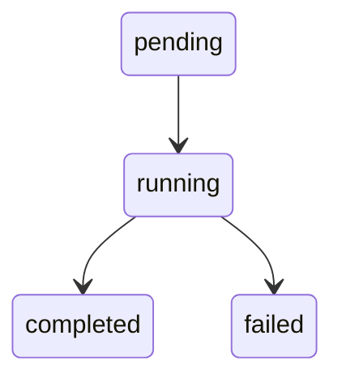

# Symbol References

Link to TypeScript types, functions, and other symbols in your documentation with `{@Symbol}` syntax.

## Overview

The symbol reference system provides JSDoc-style inline references that automatically link to source code. It's designed for API documentation, technical guides, and developer-facing content.

**Key features:**

- Inline references: `{@SymbolName}` → links to GitHub source
- Block references: `:::reference SymbolName` → full API docs
- Path hints for disambiguation: `{@path/hint#SymbolName}`
- Hover tooltips with type signatures
- Automatic error detection with helpful messages

## Quick Start

### 1. Generate Symbol Map

Create a script to scan your TypeScript files:

```typescript
// scripts/docs/generate-symbol-map.ts
import * as ts from 'typescript';
import { glob } from 'glob';
import fs from 'fs';

const files = await glob('src/**/*.ts', {
  ignore: ['**/*.test.ts', '**/node_modules/**'],
});

const symbolMap = {};

for (const file of files) {
  // Parse TypeScript and extract exported symbols
  // See EXAMPLES.md for complete script
}

fs.writeFileSync(
  'docs/.generated/symbol-map.json',
  JSON.stringify(symbolMap, null, 2)
);
```

### 2. Add Plugin

```javascript
// svelte.config.js
import { referencePlugin } from '@goobits/docs-engine/plugins';

export default {
  preprocess: [
    mdsvex({
      remarkPlugins: [
        referencePlugin(),
      ],
    }),
  ],
};
```

### 3. Use in Markdown

```markdown
# API Guide

The {@RequestState} type tracks request context.

:::reference RequestState
:::
```

## Inline References

### Basic Syntax

Reference any exported symbol by name:

```markdown
The {@WorkflowState} type manages orchestrator state.
Call {@createWorkflow} to start a new workflow.
Use {@WorkflowEventType} enum for event filtering.
```

### With Path Hints

Disambiguate symbols that appear in multiple files:

```markdown
The orchestrator uses {@orchestrator/types#SessionState} while
Jules implementor has {@implementors/types#SessionState}.
```

**Path hint format:** `{@path/hint#SymbolName}`

- `path/hint` - Substring of the file path (e.g., `implementors/types`, `server/utils`)
- `#` - Separator
- `SymbolName` - Exact symbol name

### Supported Symbol Kinds

- `type` - Type aliases (`export type Foo = ...`)
- `interface` - Interfaces (`export interface Bar { ... }`)
- `class` - Classes (`export class Baz { ... }`)
- `function` - Functions (`export function qux() { ... }`)
- `enum` - Enums (`export enum Status { ... }`)
- `const` - Constants (`export const FOO = ...`)

### Rendered Output

**Markdown:**
```markdown
{@RequestState}
```

**HTML:**
```html
<a
  href="https://github.com/org/repo/blob/main/src/types.ts#L42"
  class="symbol-ref symbol-ref--type"
  title="type RequestState = { workflowId: string; tenantId: string; }"
  target="_blank"
  rel="noopener"
>
  RequestState
</a>
```

**Styling:**

The package provides default styles, but you can customize:

```css
.symbol-ref {
  color: var(--color-link);
  text-decoration: none;
  border-bottom: 1px dotted currentColor;
}

.symbol-ref--type { color: #0ea5e9; }
.symbol-ref--interface { color: #8b5cf6; }
.symbol-ref--function { color: #10b981; }
.symbol-ref--class { color: #f59e0b; }
.symbol-ref--enum { color: #ec4899; }
.symbol-ref--const { color: #6366f1; }
```

## Block References

### Full API Documentation

Display complete API documentation for a symbol:

```markdown
:::reference RequestState
:::
```

**Rendered output:**

```html
<div class="symbol-doc">
  <div class="symbol-doc__header">
    <span class="symbol-doc__kind">type</span>
    <code class="symbol-doc__name">RequestState</code>
  </div>

  <div class="symbol-doc__signature">
    <pre><code class="language-typescript">type RequestState = {
  workflowId: string;
  sessionId?: string;
  tenantId: string;
}</code></pre>
  </div>

  <div class="symbol-doc__description">
    <p>Represents the current request context for workflow operations.</p>
  </div>

  <div class="symbol-doc__source">
    <a href="..." target="_blank">View source</a>
  </div>
</div>
```

### Selective Fields

Control which fields to display:

```markdown
:::reference createWorkflow
show: signature,params,returns
:::
```

**Available fields:**

- `signature` - Type signature or function declaration (default: shown)
- `description` - JSDoc description (default: shown)
- `params` - Function parameters (default: shown for functions)
- `returns` - Return type (default: shown for functions)
- `example` - JSDoc @example tag (default: shown if present)

### Examples

**Signature only:**

```markdown
:::reference WorkflowState
show: signature
:::
```

**Without description:**

```markdown
:::reference createWorkflow
show: signature,params,returns
:::
```

**Everything:**

```markdown
:::reference parseConfig
show: signature,description,params,returns,example
:::
```

## Disambiguation

### Why Disambiguation is Needed

When multiple files export the same symbol name:

```typescript
// src/server/orchestrator/types.ts
export interface SessionState {
  workflowId: string;
}

// src/server/implementors/types.ts
export interface SessionState {
  sessionId: string;
}
```

A reference like `{@SessionState}` is ambiguous.

### Error Messages

The plugin provides helpful error messages:

```
Symbol "SessionState" is ambiguous (2 matches).

Use a path hint to disambiguate:
  - {@implementors/types#SessionState}  // src/server/implementors/types.ts
  - {@orchestrator/types#SessionState}  // src/server/orchestrator/types.ts
```

### Path Hint Rules

1. **Minimal specificity** - Use the shortest path that uniquely identifies the symbol
2. **Directory or filename** - Prefer `types/session` over full path `src/lib/server/types/session.ts`
3. **No extension** - Omit `.ts` extension
4. **Case sensitive** - Match exact casing

**Examples:**

```markdown
<!-- Good: minimal and clear -->
{@implementors/types#SessionState}
{@utils#parseConfig}
{@types/workflow#State}

<!-- Avoid: too verbose -->
{@src/lib/server/implementors/types.ts#SessionState}

<!-- Avoid: ambiguous -->
{@types#SessionState}  <!-- Which types file? -->
```

### Algorithm

The plugin uses this matching algorithm:

1. Find all symbols with matching name
2. If exactly 1 match, return it
3. If no path hint provided, throw ambiguity error
4. Filter candidates by `symbol.path.includes(pathHint)`
5. If exactly 1 filtered match, return it
6. If 0 filtered matches, throw "path hint didn't match" error
7. If multiple filtered matches, throw ambiguity error

## JSDoc Integration

### Extracting JSDoc

The symbol generation script should extract JSDoc comments:

```typescript
/**
 * Represents the current workflow state
 * @param workflowId - Unique workflow identifier
 * @param status - Current status of the workflow
 * @returns WorkflowState instance
 * @example
 * const workflow: WorkflowState = {
 *   workflowId: '123',
 *   status: 'running',
 * };
 */
export interface WorkflowState {
  workflowId: string;
  status: 'pending' | 'running' | 'completed';
}
```

**Extracted data:**

```json
{
  "WorkflowState": [{
    "name": "WorkflowState",
    "kind": "interface",
    "jsDoc": {
      "description": "Represents the current workflow state",
      "params": [
        {
          "name": "workflowId",
          "type": "string",
          "description": "Unique workflow identifier"
        },
        {
          "name": "status",
          "type": "'pending' | 'running' | 'completed'",
          "description": "Current status of the workflow"
        }
      ],
      "example": "const workflow: WorkflowState = {\n  workflowId: '123',\n  status: 'running',\n};"
    }
  }]
}
```

### Display in Documentation

Block references automatically show JSDoc data:

```markdown
:::reference WorkflowState
:::
```

Renders:
- **Description** section with the JSDoc comment
- **Parameters** table for function params
- **Returns** section for return type
- **Example** code block if @example tag present

## Configuration

### Plugin Options

```typescript
import { referencePlugin } from '@goobits/docs-engine/plugins';

referencePlugin({
  // Future options:
  // strictMode: true,        // Fail build on missing symbols
  // symbolMapPath: '...',    // Custom symbol map location
  // onError: (error, ref) => '...',  // Custom error handling
})
```

### Symbol Map Location

The plugin searches for `symbol-map.json` in these locations (in order):

1. `docs/.generated/symbol-map.json` (relative to cwd)
2. `../docs/.generated/symbol-map.json`
3. `../../docs/.generated/symbol-map.json`

### Custom GitHub URL Format

By default, links point to `github.com/org/repo/blob/main/path#L123`.

To customize, fork the package and edit `src/lib/utils/symbol-renderer.ts`:

```typescript
export function symbolToGitHubUrl(symbol: SymbolDefinition): string {
  // Custom logic for your repo structure
  const repoPath = transformPath(symbol.path);
  const baseUrl = 'https://github.com/your-org/your-repo';
  return `${baseUrl}/blob/main/${repoPath}#L${symbol.line}`;
}
```

## Build Integration

### Pre-Build Generation

Ensure symbol map is generated before building:

```json
{
  "scripts": {
    "docs:symbols": "tsx scripts/docs/generate-symbol-map.ts",
    "prebuild": "pnpm docs:symbols",
    "build": "vite build"
  }
}
```

### Pre-Commit Hook

Keep symbol map in sync with code:

```bash
#!/bin/sh
# .husky/pre-commit

pnpm docs:symbols
git add docs/.generated/symbol-map.json
```

### CI Validation

Fail CI if symbol map is out of sync:

```yaml
# .github/workflows/docs.yml
- name: Generate symbol map
  run: pnpm docs:symbols

- name: Check for uncommitted changes
  run: |
    git diff --exit-code docs/.generated/symbol-map.json || {
      echo "Error: symbol-map.json is out of sync"
      echo "Run 'pnpm docs:symbols' and commit changes"
      exit 1
    }
```

### Watch Mode

Auto-regenerate during development:

```typescript
// scripts/docs/watch-symbols.ts
import chokidar from 'chokidar';
import { spawn } from 'child_process';

const watcher = chokidar.watch('src/**/*.ts', {
  ignored: ['**/*.test.ts'],
});

watcher.on('change', () => {
  spawn('tsx', ['scripts/docs/generate-symbol-map.ts'], {
    stdio: 'inherit',
  });
});
```

See [EXAMPLES.md](./EXAMPLES.md#watch-mode) for complete watch mode implementation.

## Performance

### Caching

Implement caching in your generation script:

```typescript
interface CacheEntry {
  mtime: number;
  hash: string;
  symbols: SymbolDefinition[];
}

const cache: Record<string, CacheEntry> = loadCache();

for (const file of files) {
  if (!hasFileChanged(file, cache[file])) {
    // Use cached symbols
    console.log(`💾 Using cached ${file}`);
    continue;
  }

  // Process file
  const symbols = extractSymbols(file);
  cache[file] = {
    mtime: fs.statSync(file).mtimeMs,
    hash: hashFile(file),
    symbols,
  };
}

saveCache(cache);
```

### Benchmark Results

Example from Spacebase monorepo (327 files):

| Scenario | Time | Files Processed |
|----------|------|-----------------|
| Cold (no cache) | 8.2s | 327 |
| Warm (100% cache hit) | 1.1s | 0 |
| Partial (50% cache hit) | 4.5s | 164 |

**Recommendation:** Always implement caching for projects with 100+ files.

## Troubleshooting

### Symbol Not Found

**Error:**
```
Symbol "FooBar" not found.

Did you mean one of these?
  - {@Foo}
  - {@Bar}
  - {@FooBaz}
```

**Solutions:**

1. Check if symbol is exported: `export type FooBar = ...`
2. Regenerate symbol map: `pnpm docs:symbols`
3. Verify file is included in `SOURCE_PATTERNS`
4. Check file isn't excluded by `EXCLUDE_PATTERNS`

### Ambiguous Symbol

**Error:**
```
Symbol "SessionState" is ambiguous (2 matches).

Use a path hint to disambiguate:
  - {@implementors/types#SessionState}
  - {@orchestrator/types#SessionState}
```

**Solution:** Use the suggested path hint.

### Symbol Map Out of Sync

**Symptom:** Old symbol definitions appear in documentation.

**Solution:**

```bash
# Clear cache
rm .dev/tmp/symbol-cache.json

# Regenerate
pnpm docs:symbols

# Verify
git diff docs/.generated/symbol-map.json
```

### Module Resolution Errors

**Error:**
```
Cannot find module '@goobits/docs-engine/utils'
```

**Solution:** Ensure `tsconfig.json` uses modern module resolution:

```json
{
  "compilerOptions": {
    "moduleResolution": "bundler",
    "resolvePackageJsonExports": true
  }
}
```

## API Reference

### Core Types

```typescript
interface SymbolDefinition {
  name: string;
  path: string;
  line: number;
  kind: 'type' | 'interface' | 'class' | 'function' | 'enum' | 'const';
  exported: boolean;
  jsDoc?: {
    description?: string;
    params?: Array<{ name: string; description: string; type: string }>;
    returns?: string;
    example?: string;
  };
  signature: string;
}

interface SymbolMap {
  [symbolName: string]: SymbolDefinition[];
}
```

### Functions

```typescript
// Load symbol map (with caching)
function loadSymbolMap(): SymbolMap;

// Resolve reference to definition
function resolveSymbol(
  reference: string,    // e.g., "Foo" or "path#Foo"
  symbolMap: SymbolMap
): SymbolDefinition;

// Convert symbol to GitHub URL
function symbolToGitHubUrl(symbol: SymbolDefinition): string;

// Render inline reference
function renderInline(symbol: SymbolDefinition): string;

// Render block reference
function renderBlock(
  symbol: SymbolDefinition,
  options?: RenderOptions
): string;
```

### Errors

```typescript
class AmbiguousSymbolError extends Error {
  constructor(
    symbolName: string,
    candidates: SymbolDefinition[] | string[],
    pathHint?: string,
    customMessage?: string
  );
}
```

## Best Practices

### 1. Use Inline for Mentions

```markdown
<!-- Good: inline reference -->
The {@RequestState} type tracks context.

<!-- Avoid: block for simple mention -->
:::reference RequestState
:::
```

### 2. Use Block for Detailed Docs

```markdown
<!-- Good: full API documentation -->
## RequestState

:::reference RequestState
:::

<!-- Avoid: inline for main API docs -->
See {@RequestState} for details.
```

### 3. Add Path Hints Proactively

```markdown
<!-- Good: prevents future ambiguity -->
{@orchestrator/types#SessionState}

<!-- Avoid: rely on error messages -->
{@SessionState}  <!-- Might break when new file added -->
```

### 4. Document Complex Types

```markdown
## API Types

### WorkflowState

Main state machine for the orchestrator.

:::reference WorkflowState
:::

**State transitions:**



**Related:**
- {@SessionState} - Jules session state
- {@WorkflowEventType} - Event types
```

### 5. Group Related Symbols

```markdown
## Core Types

| Type | Description |
|------|-------------|
| {@WorkflowState} | Main orchestrator state |
| {@SessionState} | Jules session lifecycle |
| {@ProposalMetadata} | Proposal configuration |

## Utility Functions

- {@createWorkflow} - Initialize workflow
- {@updateWorkflow} - Update workflow state
- {@getWorkflowStatus} - Query status
```

## Related Documentation

- **[Architecture](./ARCHITECTURE.md)** - Package/consumer split and design decisions
- **[Examples](./EXAMPLES.md)** - Code examples and recipes
- **[README](../README.md)** - Installation and quick start

---

**Need help?** Open an issue on GitHub with your use case.
