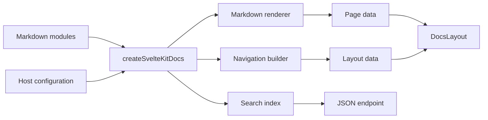

# Architecture

Docs Engine has three ownership layers: the runtime package, the CLI package, and the host project. Each concept has one canonical owner so projects can customize policy without copying infrastructure.

## Ownership

### Runtime package

`@goobits/docs-engine` owns reusable documentation behavior:

- Markdown parsing and rendering
- navigation and search-index construction
- the SvelteKit docs adapter
- Svelte layout, navigation, search, and hydrator components
- low-level Markdown plugins
- symbol resolution and source-link rendering
- Node-only screenshot, Git, and file utilities behind `/server`
- compiled package entry points and shared styles

The runtime does not own a project's package catalog, release policy, repository layout, or hosted deployment.

### CLI package

`@goobits/docs-engine-cli` owns reusable build-time tooling:

- complete SvelteKit project scaffolding
- TypeScript API symbol extraction
- generated API reference output
- Markdown link validation
- documentation version commands

The CLI accepts caller-owned paths, export filters, repository metadata, and output directories. It does not encode Goobits workspace structure.

### Host project

The consuming project owns only project-specific inputs and policy:

- Markdown content
- route prefix and feature configuration
- repository URL and edit-link metadata
- which packages or export surfaces belong in a reference catalog
- branding around the shared `DocsLayout`
- deployment adapter and hosting configuration

Host routes should stay thin. Page loading, rendering, navigation, and search belong to the shared SvelteKit adapter.

## Request flow



`createSvelteKitDocs` caches loaded Markdown, navigation, and search data for the lifetime of the server module. Failed loads are removed from the cache so a later request can retry.

## Public boundaries

| Import | Environment | Responsibility |
| --- | --- | --- |
| `@goobits/docs-engine` | Browser and build | Top-level documentation configuration |
| `@goobits/docs-engine/sveltekit` | SvelteKit server | Markdown directory adapter and route handlers |
| `@goobits/docs-engine/components` | Svelte | Documentation UI and hydrators |
| `@goobits/docs-engine/server` | Node | Screenshots, Git, files, and server rendering |
| `@goobits/docs-engine/plugins` | Build | Individual Markdown transformations |
| `@goobits/docs-engine/reference` | Build and server | Symbol resolution and rendering |
| `@goobits/docs-engine/styles` | CSS | Shared tokens and component styles |
| `@goobits/docs-engine-cli/library` | Node | Reference extraction, rendering, and output helpers |

Published imports resolve to compiled JavaScript and declarations. The `source` condition exists for linked monorepo development and is not required by consumers.

Components are public only through `@goobits/docs-engine/components`. Their implementation-file paths are private so internal organization can change without expanding the package API.

## SvelteKit integration

One server module creates the docs owner:

```ts
import { error } from '@sveltejs/kit';
import {
  createDocsLayoutLoad,
  createDocsPageLoad,
  createDocsSearchHandler,
  createSvelteKitDocs,
} from '@goobits/docs-engine/sveltekit';

const docs = createSvelteKitDocs({ modules, config });

export const loadDocsLayout = createDocsLayoutLoad(docs);
export const loadDocsPage = createDocsPageLoad(docs, error);
export const getDocsSearch = createDocsSearchHandler(docs);
```

The host passes its own SvelteKit `error` function. This prevents duplicate framework instances when docs-engine is linked or installed through a package store.

Index and catch-all page routes reuse `loadDocsPage`. The search route reuses `getDocsSearch`. Both page components reuse one host-owned wrapper around `DocsLayout`.

## Reference generation

Reference generation has a reusable pipeline and a project-specific catalog:

```text
package manifests + source
  -> workspacePackageExtractor
  -> project catalog and export filter
  -> reference renderers
  -> generatedReferenceOutput
  -> Markdown pages
```

The CLI library owns source traversal, export reachability, TypeScript and Svelte symbol extraction, generic rendering helpers, and generated-file validation. A monorepo can keep its package tiers, curated groups, Rust or OpenAPI providers, and docs fact checks in its own repository.

For a single package, use the CLI command:

```bash
docs-engine reference \
  --root . \
  --source 'src/**/*.ts' \
  --output-dir docs/api \
  --repository-url https://github.com/acme/widgets
```

## Extension points

- `resolvePath` maps nonstandard Markdown loader paths to docs-relative paths.
- `references` supplies a symbol map and repository metadata to the reference plugin.
- `MarkdownDocsOptions` configures rendering, search, screenshots, routes, Git links, and SEO.
- `DocsLayout` props customize breadcrumbs, footer content, enabled hydrators, themes, and host loading UI.
- CLI library filters select which package export keys belong in generated public reference pages.

Prefer these extension points over copying the adapter, renderer, route handlers, or generated-page writer.

## Deployment boundary

Docs Engine does not choose a production adapter. The host project installs the SvelteKit adapter required by its platform. The scaffold uses `@sveltejs/adapter-auto` as a portable starting point.

Screenshot execution is disabled unless explicitly enabled. Web screenshot hosts and CLI commands fail closed unless allowlists are configured.

## Verification boundary

Package verification covers runtime tests, Svelte type checking, lint, package builds, and packed imports. Host verification covers content links, project type checking, the production build, and HTTP behavior for docs pages, search, and 404s.
