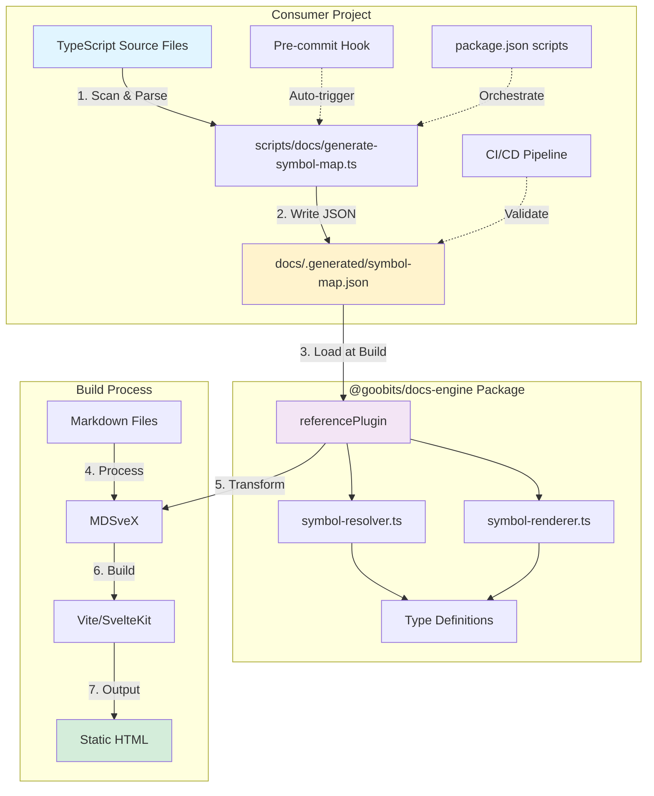
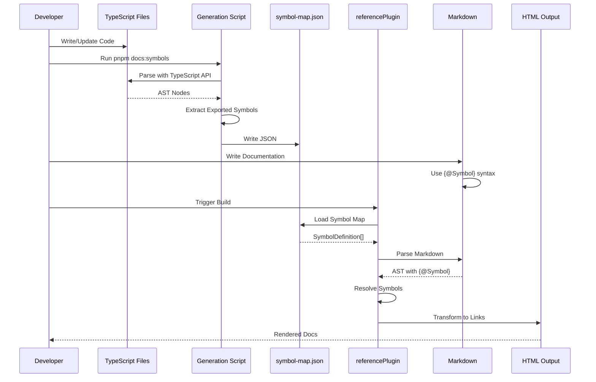
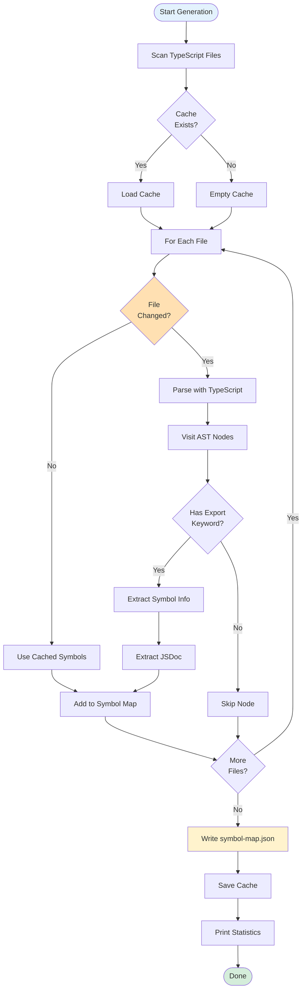
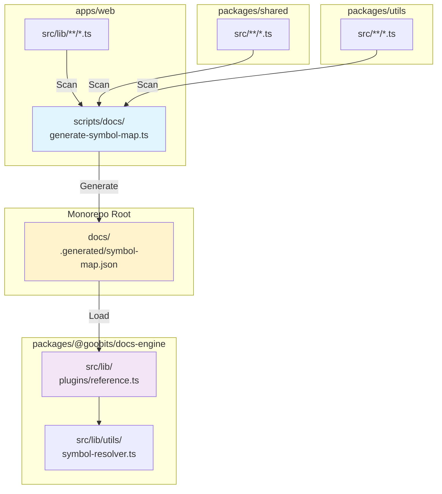
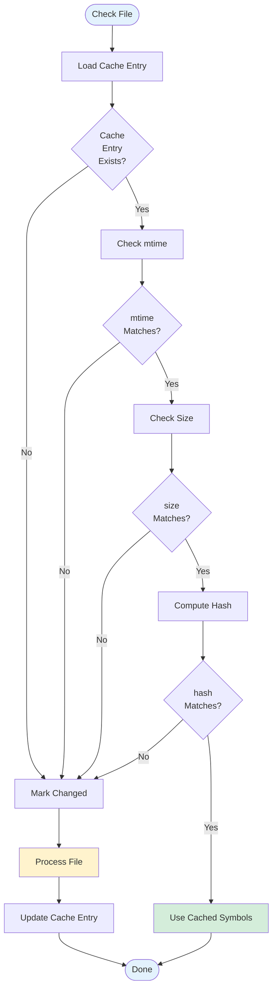
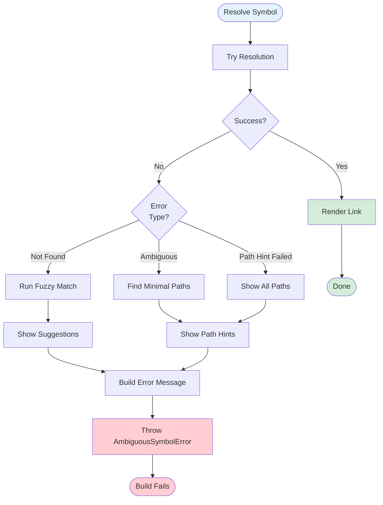

# Architecture Diagrams

Visual representations of the docs-engine symbol reference system.

## System Overview



## Data Flow



## Package Architecture

```mermaid
graph LR
    subgraph "Public API"
        A[/plugins]
        B[/utils]
        C[/components]
        D[/server]
    end

    subgraph "Core Plugins"
        E[referencePlugin]
        F[linksPlugin]
        G[screenshotPlugin]
        H[Other Plugins]
    end

    subgraph "Symbol System"
        I[symbol-resolver]
        J[symbol-renderer]
        K[Type Defs]
    end

    subgraph "Utilities"
        L[frontmatter]
        M[navigation-builder]
        N[search]
    end

    A --> E
    A --> F
    A --> G
    A --> H

    B --> I
    B --> J
    B --> K
    B --> L
    B --> M
    B --> N

    E --> I
    E --> J
    I --> K
    J --> K

    style A fill:#f3e5f5
    style B fill:#e3f2fd
    style E fill:#fff3cd
    style I fill:#d4edda
```

## Symbol Resolution Algorithm

```mermaid
flowchart TD
    Start([Parse {@Symbol}]) --> Load[Load Symbol Map]
    Load --> Parse[Parse Reference]
    Parse --> Hint{Path Hint<br/>Provided?}

    Hint -->|No| Lookup1[Lookup Symbol Name]
    Lookup1 --> Count1{Match<br/>Count?}
    Count1 -->|0| NotFound[Symbol Not Found<br/>Suggest Similar]
    Count1 -->|1| Found[Return Symbol]
    Count1 -->|>1| Ambiguous1[Ambiguous Error<br/>Show All Paths]

    Hint -->|Yes| Lookup2[Lookup Symbol Name]
    Lookup2 --> Filter[Filter by Path Hint]
    Filter --> Count2{Match<br/>Count?}
    Count2 -->|0| NoMatch[Path Hint No Match<br/>Show All Paths]
    Count2 -->|1| Found
    Count2 -->|>1| Ambiguous2[Still Ambiguous<br/>Need More Specific Hint]

    Found --> Render[Render as Link]
    Render --> End([Done])

    NotFound --> Error1[Throw Error]
    Ambiguous1 --> Error1
    NoMatch --> Error1
    Ambiguous2 --> Error1

    style Start fill:#e3f2fd
    style Found fill:#d4edda
    style Error1 fill:#ffcdd2
    style End fill:#e3f2fd
```

## Symbol Generation Flow



## Consumer Setup Flow

```mermaid
flowchart LR
    Start([New Project]) --> Install[pnpm add<br/>@goobits/docs-engine]
    Install --> CreateScript[Create Generation Script]
    CreateScript --> ConfigPlugin[Add referencePlugin<br/>to svelte.config.js]
    ConfigPlugin --> AddScripts[Add npm Scripts]
    AddScripts --> Generate[Run pnpm docs:symbols]
    Generate --> UseInDocs[Use {@Symbol}<br/>in Markdown]
    UseInDocs --> Optional{Want<br/>Automation?}

    Optional -->|Yes| PreCommit[Setup Pre-commit Hook]
    Optional -->|No| Done([Done])
    PreCommit --> CI[Setup CI Validation]
    CI --> Watch[Setup Watch Mode]
    Watch --> Done

    style Start fill:#e3f2fd
    style Generate fill:#fff3cd
    style Done fill:#d4edda
```

## Monorepo Structure



## Plugin Transformation Pipeline

```mermaid
flowchart LR
    MD1[Markdown Input] --> Parse[MDSveX Parse]
    Parse --> AST1[MDAST]

    AST1 --> P1[filetreePlugin]
    P1 --> AST2[MDAST]
    AST2 --> P2[calloutsPlugin]
    P2 --> AST3[MDAST]
    AST3 --> P3[mermaidPlugin]
    P3 --> AST4[MDAST]
    AST4 --> P4[tabsPlugin]
    P4 --> AST5[MDAST]
    AST5 --> P5[remarkTableOfContents]
    P5 --> AST6[MDAST]
    AST6 --> P6[linksPlugin]
    P6 --> AST7[MDAST]
    AST7 --> P7[referencePlugin]
    P7 --> AST8[MDAST<br/>with symbol links]
    AST8 --> P8[screenshotPlugin]
    P8 --> AST9[MDAST]
    AST9 --> P9[codeHighlightPlugin]
    P9 --> AST10[MDAST]

    AST10 --> Render[MDSveX Render]
    Render --> HTML[HTML Output]

    style MD1 fill:#e3f2fd
    style P7 fill:#fff3cd
    style HTML fill:#d4edda
```



## Caching Strategy



## Error Handling Flow



---

## Legend

- **Blue** - Input/Start/End
- **Yellow** - Processing/Transformation
- **Green** - Success/Output
- **Red** - Error/Failure
- **Purple** - Package Components
- **Orange** - Decision Points

---

See also:
- [Architecture Guide](./architecture.md)
- [Examples](./examples.md)
- [Symbol References](../plugins/symbol-references.md)
