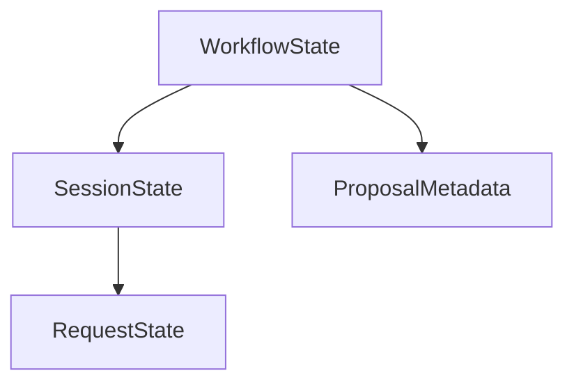

# Examples: Symbol Reference System

Practical examples and recipes for using the symbol reference system in your documentation.

## Table of Contents

- [Basic Usage](#basic-usage)
- [Disambiguation](#disambiguation)
- [Block References](#block-references)
- [Generation Scripts](#generation-scripts)
- [Monorepo Setup](#monorepo-setup)
- [Custom Symbol Kinds](#custom-symbol-kinds)
- [Caching Strategies](#caching-strategies)
- [Watch Mode](#watch-mode)
- [Error Handling](#error-handling)
- [Common Patterns](#common-patterns)

## Basic Usage

### Inline References

Reference types, functions, and other symbols inline:

```markdown
# API Guide

The {@RequestState} type represents the current request context.
Call {@createWorkflow} to start a new workflow instance.
Use {@WorkflowEventType} to filter event subscriptions.
```

**Rendered output:**

```html
<p>
  The <a href="..." class="symbol symbol--type" title="type RequestState = ...">RequestState</a> type represents the current request context.
  Call <a href="..." class="symbol symbol--function" title="function createWorkflow(...)">createWorkflow</a> to start a new workflow instance.
  Use <a href="..." class="symbol symbol--enum" title="enum WorkflowEventType">WorkflowEventType</a> to filter event subscriptions.
</p>
```

### Multiple References in One Paragraph

```markdown
The {@WorkflowOrchestrator} manages {@WorkflowState} using {@ImplementorSession} instances. Each session has a {@SessionState} that tracks progress.
```

### References in Lists

```markdown
## Core Types

- {@WorkflowState} - Main orchestrator state
- {@SessionState} - Jules session state
- {@RequestState} - HTTP request context
- {@ProposalMetadata} - Proposal configuration
```

### References in Tables

```markdown
| Type | Description | Location |
|------|-------------|----------|
| {@WorkflowState} | Orchestrator state machine | `server/core/orchestrator/types.ts` |
| {@SessionState} | Jules session lifecycle | `server/implementors/types.ts` |
| {@ProposalMetadata} | Proposal configuration | `server/types/proposals.ts` |
```

## Disambiguation

### Using Path Hints

When multiple symbols share the same name, use path hints:

```markdown
# Session Management

The orchestrator uses {@orchestrator/types#SessionState} while
the Jules implementor defines {@implementors/types#SessionState}.
```

**How path hints work:**

```typescript
// Symbol map contains multiple definitions
{
  "SessionState": [
    { name: "SessionState", path: "src/server/orchestrator/types.ts", ... },
    { name: "SessionState", path: "src/server/implementors/types.ts", ... }
  ]
}

// Reference: {@implementors/types#SessionState}
// Matches: path.includes("implementors/types")
```

### Minimal Path Hints

Use the shortest path that uniquely identifies the symbol:

```markdown
<!-- Minimal path hint -->
{@types#SessionState}

<!-- Overly specific (not needed) -->
{@src/lib/server/implementors/types.ts#SessionState}

<!-- Best practice: directory or filename -->
{@implementors/types#SessionState}
```

### Error Messages Guide You

The plugin provides helpful error messages:

```
Symbol "SessionState" is ambiguous (2 matches).

Use a path hint to disambiguate:
  - {@implementors/types#SessionState}  // src/lib/server/implementors/types.ts
  - {@orchestrator/types#SessionState}  // src/lib/server/orchestrator/types.ts
```

Just copy the suggested path hint!

## Block References

### Full API Documentation

Show complete API documentation with the block syntax:

```markdown
# RequestState API

:::reference RequestState
:::
```

**Rendered output:**

```html
<div class="symbol-doc">
  <div class="symbol-doc__header">
    <span class="symbol-doc__kind">type</span>
    <code class="symbol-doc__name">RequestState</code>
  </div>

  <div class="symbol-doc__signature">
    <pre><code class="language-typescript">type RequestState = {
  workflowId: string;
  sessionId?: string;
  tenantId: string;
}
    </code></pre>
  </div>

  <div class="symbol-doc__description">
    <p>Represents the current request context...</p>
  </div>

  <div class="symbol-doc__source">
    <a href="..." target="_blank">View source</a>
  </div>
</div>
```

### Selective Field Display

Control which fields to show:

```markdown
:::reference createWorkflow
show: signature,params,returns
:::
```

Available fields:
- `signature` - Type signature or function declaration
- `description` - JSDoc description
- `params` - Function parameters (for functions only)
- `returns` - Return type (for functions only)
- `example` - JSDoc @example tag

### Signature Only

```markdown
:::reference WorkflowState
show: signature
:::
```

### With Examples

```markdown
:::reference parseConfig
show: signature,description,example
:::
```

## Generation Scripts

### Minimal Script (Single Package)

```typescript
#!/usr/bin/env tsx
import * as ts from 'typescript';
import fs from 'fs';

interface SymbolDefinition {
  name: string;
  path: string;
  line: number;
  kind: 'type' | 'interface' | 'class' | 'function' | 'enum' | 'const';
  exported: boolean;
  signature: string;
}

const symbolMap: Record<string, SymbolDefinition[]> = {};

// Scan specific files
const files = ['src/index.ts', 'src/utils.ts', 'src/types.ts'];

for (const file of files) {
  const code = fs.readFileSync(file, 'utf-8');
  const source = ts.createSourceFile(file, code, ts.ScriptTarget.Latest, true);

  function visit(node: ts.Node) {
    const hasExport = node.modifiers?.some(
      m => m.kind === ts.SyntaxKind.ExportKeyword
    );

    if (hasExport && ts.isTypeAliasDeclaration(node)) {
      const symbol: SymbolDefinition = {
        name: node.name.text,
        path: file,
        line: source.getLineAndCharacterOfPosition(node.getStart()).line + 1,
        kind: 'type',
        exported: true,
        signature: `type ${node.name.text} = ${node.type.getText(source)}`,
      };

      if (!symbolMap[symbol.name]) {
        symbolMap[symbol.name] = [];
      }
      symbolMap[symbol.name].push(symbol);
    }

    ts.forEachChild(node, visit);
  }

  visit(source);
}

// Write output
fs.mkdirSync('docs/.generated', { recursive: true });
fs.writeFileSync(
  'docs/.generated/symbol-map.json',
  JSON.stringify(symbolMap, null, 2)
);

console.log(`Generated ${Object.keys(symbolMap).length} symbols`);
```

### Full-Featured Script (with Glob)

```typescript
#!/usr/bin/env tsx
import * as ts from 'typescript';
import { glob } from 'glob';
import fs from 'fs';
import path from 'path';

interface SymbolDefinition {
  name: string;
  path: string;
  line: number;
  kind: 'type' | 'interface' | 'class' | 'function' | 'enum' | 'const';
  exported: boolean;
  jsDoc?: {
    description?: string;
    params?: Array<{ name: string; description: string; type: string }>;
    returns?: string;
    example?: string;
  };
  signature: string;
}

const SOURCE_PATTERNS = [
  'src/**/*.ts',
  '../packages/*/src/**/*.ts',
];

const EXCLUDE_PATTERNS = [
  '**/*.test.ts',
  '**/*.spec.ts',
  '**/node_modules/**',
  '**/dist/**',
];

async function generateSymbolMap() {
  const symbolMap: Record<string, SymbolDefinition[]> = {};

  // Find all TypeScript files
  const files = await glob(SOURCE_PATTERNS, {
    ignore: EXCLUDE_PATTERNS,
    absolute: false,
  });

  console.log(`Found ${files.length} TypeScript files`);

  for (const file of files) {
    const code = fs.readFileSync(file, 'utf-8');
    const source = ts.createSourceFile(file, code, ts.ScriptTarget.Latest, true);

    function visit(node: ts.Node) {
      const hasExport = node.modifiers?.some(
        m => m.kind === ts.SyntaxKind.ExportKeyword
      );

      if (!hasExport) {
        ts.forEachChild(node, visit);
        return;
      }

      let symbol: SymbolDefinition | null = null;

      if (ts.isTypeAliasDeclaration(node)) {
        symbol = {
          name: node.name.text,
          path: file,
          line: source.getLineAndCharacterOfPosition(node.getStart()).line + 1,
          kind: 'type',
          exported: true,
          jsDoc: extractJSDoc(node, source),
          signature: `type ${node.name.text} = ${node.type.getText(source)}`,
        };
      } else if (ts.isInterfaceDeclaration(node)) {
        const members = node.members.map(m => m.getText(source)).join(';\n  ');
        symbol = {
          name: node.name.text,
          path: file,
          line: source.getLineAndCharacterOfPosition(node.getStart()).line + 1,
          kind: 'interface',
          exported: true,
          jsDoc: extractJSDoc(node, source),
          signature: `interface ${node.name.text} {\n  ${members}\n}`,
        };
      } else if (ts.isFunctionDeclaration(node) && node.name) {
        const params = node.parameters.map(p => p.getText(source)).join(', ');
        const returnType = node.type ? `: ${node.type.getText(source)}` : '';
        symbol = {
          name: node.name.text,
          path: file,
          line: source.getLineAndCharacterOfPosition(node.getStart()).line + 1,
          kind: 'function',
          exported: true,
          jsDoc: extractJSDoc(node, source),
          signature: `function ${node.name.text}(${params})${returnType}`,
        };
      }

      if (symbol) {
        if (!symbolMap[symbol.name]) {
          symbolMap[symbol.name] = [];
        }
        symbolMap[symbol.name].push(symbol);
        console.log(`  ✓ ${symbol.kind} ${symbol.name}`);
      }

      ts.forEachChild(node, visit);
    }

    visit(source);
  }

  // Write output
  const outputDir = path.resolve('docs/.generated');
  const outputPath = path.join(outputDir, 'symbol-map.json');

  fs.mkdirSync(outputDir, { recursive: true });
  fs.writeFileSync(outputPath, JSON.stringify(symbolMap, null, 2));

  console.log(`\n✅ Generated ${Object.keys(symbolMap).length} symbols`);
  console.log(`   Output: ${outputPath}`);
}

function extractJSDoc(node: ts.Node, source: ts.SourceFile) {
  const jsDocComments = (node as any).jsDoc;
  if (!jsDocComments || jsDocComments.length === 0) return undefined;

  const jsDoc = jsDocComments[0];
  const description = jsDoc.comment || '';

  return {
    description: typeof description === 'string'
      ? description
      : description.map((c: any) => c.text).join(''),
    params: jsDoc.tags
      ?.filter((t: any) => t.tagName.text === 'param')
      .map((t: any) => ({
        name: t.name?.text || '',
        description: t.comment || '',
        type: t.typeExpression?.type?.getText(source) || 'unknown',
      })),
    returns: jsDoc.tags?.find((t: any) => t.tagName.text === 'returns')?.comment,
    example: jsDoc.tags?.find((t: any) => t.tagName.text === 'example')?.comment,
  };
}

generateSymbolMap().catch(console.error);
```

## Monorepo Setup

### Structure

```
monorepo/
├── apps/
│   └── web/
│       ├── src/lib/**/*.ts
│       └── scripts/docs/generate-symbol-map.ts
├── packages/
│   ├── shared/
│   │   └── src/**/*.ts
│   └── utils/
│       └── src/**/*.ts
└── docs/
    ├── .generated/
    │   └── symbol-map.json
    └── api/
        └── reference.md
```

### Generation Script (Monorepo)

```typescript
import { glob } from 'glob';
import path from 'path';

const SOURCE_PATTERNS = [
  // Main app
  'src/lib/**/*.ts',

  // All packages
  '../packages/*/src/**/*.ts',

  // Specific packages only
  '../packages/shared/src/**/*.ts',
  '../packages/utils/src/**/*.ts',
];

async function generateSymbolMap() {
  const symbolMap: Record<string, SymbolDefinition[]> = {};

  // Scan all packages
  const files = await glob(SOURCE_PATTERNS, {
    cwd: process.cwd(), // apps/web/
    ignore: EXCLUDE_PATTERNS,
  });

  // ... process files ...

  // Output to root docs/ directory
  const outputPath = path.resolve('../../docs/.generated/symbol-map.json');
  fs.writeFileSync(outputPath, JSON.stringify(symbolMap, null, 2));
}
```

### Usage with Package Prefixes

```markdown
# API Reference

## Shared Package

- {@shared/types#RequestState}
- {@shared/utils#parseConfig}

## Utils Package

- {@utils/validation#validateInput}
- {@utils/formatting#formatDate}
```

## Custom Symbol Kinds

### Svelte Components

Extract Svelte component props:

```typescript
// In generate-symbol-map.ts
import { parse } from 'svelte/compiler';

async function extractSvelteComponents() {
  const components = await glob('src/lib/components/**/*.svelte');

  for (const file of components) {
    const code = fs.readFileSync(file, 'utf-8');
    const ast = parse(code);

    // Extract props from <script> tag
    const props = extractProps(ast);

    const componentName = path.basename(file, '.svelte');
    symbolMap[componentName] = [{
      name: componentName,
      path: file,
      line: 1,
      kind: 'component' as any, // Extend SymbolKind type
      exported: true,
      signature: `<${componentName} ${props.join(' ')} />`,
    }];
  }
}
```

### React Hooks

```typescript
// Detect custom hooks: use* pattern
if (ts.isFunctionDeclaration(node) && node.name?.text.startsWith('use')) {
  symbol.kind = 'hook' as any;
  symbol.signature = `function ${node.name.text}(...): ${returnType}`;
}
```

### Zod Schemas

```typescript
// Detect Zod schemas: z.object() pattern
if (ts.isVariableStatement(node)) {
  const declaration = node.declarationList.declarations[0];
  if (declaration.initializer?.getText().includes('z.object')) {
    symbol.kind = 'schema' as any;
    symbol.signature = `const ${declaration.name.getText()} = z.object(...)`;
  }
}
```

## Caching Strategies

### File Hash-Based Cache

```typescript
import crypto from 'crypto';

interface CacheEntry {
  mtime: number;
  size: number;
  hash: string;
  symbols: SymbolDefinition[];
}

const CACHE_FILE = '.dev/tmp/symbol-cache.json';

function loadCache(): Record<string, CacheEntry> {
  if (!fs.existsSync(CACHE_FILE)) {
    return {};
  }
  return JSON.parse(fs.readFileSync(CACHE_FILE, 'utf-8'));
}

function hashFile(file: string): string {
  const content = fs.readFileSync(file, 'utf-8');
  return crypto.createHash('md5').update(content).digest('hex');
}

function hasFileChanged(file: string, cached?: CacheEntry): boolean {
  if (!cached) return true;

  const stats = fs.statSync(file);

  // Quick check: mtime and size
  if (stats.mtimeMs !== cached.mtime || stats.size !== cached.size) {
    return true;
  }

  // Verify with hash
  return hashFile(file) !== cached.hash;
}

async function generateSymbolMap() {
  const cache = loadCache();
  const newCache: Record<string, CacheEntry> = {};

  for (const file of files) {
    if (!hasFileChanged(file, cache[file])) {
      // Use cached symbols
      console.log(`💾 Using cached ${file}`);
      newCache[file] = cache[file];

      // Add symbols to map
      for (const symbol of cache[file].symbols) {
        if (!symbolMap[symbol.name]) {
          symbolMap[symbol.name] = [];
        }
        symbolMap[symbol.name].push(symbol);
      }
      continue;
    }

    // Process file and update cache
    const symbols = processFile(file);
    const stats = fs.statSync(file);

    newCache[file] = {
      mtime: stats.mtimeMs,
      size: stats.size,
      hash: hashFile(file),
      symbols,
    };
  }

  // Save cache
  fs.writeFileSync(CACHE_FILE, JSON.stringify(newCache, null, 2));
}
```

### Cache Statistics

```typescript
const cacheHits = files.filter(f => !hasFileChanged(f, cache[f])).length;
const cacheMisses = files.length - cacheHits;

console.log(`\n📊 Cache statistics:`);
console.log(`   Hits:   ${cacheHits} (${(cacheHits / files.length * 100).toFixed(1)}%)`);
console.log(`   Misses: ${cacheMisses} (${(cacheMisses / files.length * 100).toFixed(1)}%)`);
```

## Watch Mode

### Basic Watch Mode

```typescript
#!/usr/bin/env tsx
import chokidar from 'chokidar';
import { spawn } from 'child_process';

const watcher = chokidar.watch('src/**/*.ts', {
  ignored: ['**/*.test.ts', '**/node_modules/**'],
  persistent: true,
  ignoreInitial: true,
});

let debounceTimer: NodeJS.Timeout | null = null;

watcher.on('change', (path) => {
  console.log(`📝 File changed: ${path}`);

  if (debounceTimer) clearTimeout(debounceTimer);

  debounceTimer = setTimeout(() => {
    console.log('⚙️ Regenerating symbol map...');

    const child = spawn('tsx', ['scripts/docs/generate-symbol-map.ts'], {
      stdio: 'inherit',
    });

    child.on('close', (code) => {
      if (code === 0) {
        console.log('✅ Symbol map updated');
      } else {
        console.error(`❌ Error (exit code ${code})`);
      }
    });
  }, 500);
});

console.log('👀 Watching TypeScript files for changes...');
```

### Advanced Watch Mode (Docker-Compatible)

```typescript
import chokidar from 'chokidar';

const watcher = chokidar.watch(['src/**/*.ts', '../packages/*/src/**/*.ts'], {
  ignored: EXCLUDE_PATTERNS,
  persistent: true,
  ignoreInitial: true,

  // Required for Docker environments
  usePolling: true,
  interval: 1000,
  binaryInterval: 3000,

  // Wait for file writes to complete
  awaitWriteFinish: {
    stabilityThreshold: 200,
    pollInterval: 100,
  },
});

let pendingFiles = new Set<string>();
let isRegenerating = false;

function regenerate() {
  if (isRegenerating) {
    console.log('⏳ Regeneration in progress, queuing...');
    return;
  }

  isRegenerating = true;
  const files = Array.from(pendingFiles);
  pendingFiles.clear();

  console.log(`\n⚙️ Regenerating symbol map (${files.length} files changed)...`);

  const child = spawn('tsx', ['scripts/docs/generate-symbol-map.ts'], {
    stdio: ['inherit', 'pipe', 'pipe'],
  });

  child.on('close', (code) => {
    isRegenerating = false;
    if (code === 0) {
      console.log('✅ Symbol map updated');
    } else {
      console.error(`❌ Error (exit code ${code})`);
    }
    console.log('👀 Watching for changes...');
  });
}

watcher.on('change', (path) => {
  pendingFiles.add(path);

  if (debounceTimer) clearTimeout(debounceTimer);
  debounceTimer = setTimeout(regenerate, 500);
});

// Graceful shutdown
process.on('SIGINT', () => {
  console.log('\n👋 Stopping file watcher...');
  watcher.close().then(() => {
    console.log('✅ File watcher stopped');
    process.exit(0);
  });
});
```

## Error Handling

### Graceful Degradation

```markdown
# API Reference

<!-- Symbol exists: renders as link -->
{@RequestState}

<!-- Symbol doesn't exist: shows error -->
{@NonExistentType}
<!-- Error: Symbol "NonExistentType" not found. Did you mean {@RequestStatus}? -->
```

### Custom Error Handling (Future)

```typescript
// Future plugin option
referencePlugin({
  onError: (error, reference) => {
    console.warn(`⚠️ Symbol not found: {@${reference}}`);

    // Return fallback HTML
    return `<code class="symbol-ref--missing">${reference}</code>`;
  },
});
```

### Pre-Build Validation

```bash
# In package.json
{
  "scripts": {
    "docs:validate": "pnpm docs:symbols && pnpm build",
    "prebuild": "pnpm docs:validate"
  }
}
```

This ensures the symbol map is up-to-date before every build.

## Common Patterns

### API Reference Page

```markdown
---
title: API Reference
---

# Core Types

## WorkflowState

The main state machine for the orchestrator.

:::reference WorkflowState
:::

**Usage:**

{@typescript}
const workflow: WorkflowState = {
  workflowId: '123',
  status: 'running',
  ...
};
{@/typescript}

## SessionState

Tracks Jules session lifecycle.

:::reference SessionState
:::

**Related:**
- {@WorkflowState}
- {@ImplementorSession}
```

### Type Relationships

```markdown
# Type Hierarchy



- {@WorkflowState} - Root orchestrator state
  - {@SessionState} - Jules session tracking
    - {@RequestState} - HTTP request context
  - {@ProposalMetadata} - Proposal configuration
```

### Migration Guides

```markdown
# Migration Guide: v1 → v2

## Breaking Changes

### RequestState Type

**Before (v1):**
```typescript
// Old structure
type RequestState = {
  id: string;
  userId: string;
};
```

**After (v2):**
{@typescript}
// New structure: {@RequestState}
:::reference RequestState
show: signature
:::
{@/typescript}

**Migration:**
- Rename `id` → `workflowId`
- Rename `userId` → `tenantId`
```

### Inline Code with References

```markdown
Call {@createWorkflow()} to initialize:

{@typescript}
const workflow = await createWorkflow({
  proposalId: 'abc123',
  tenantId: 'tenant-1',
});
{@/typescript}

Returns {@WorkflowState}.
```

---

## Next Steps

- [Architecture Guide](./architecture.md) - Understand the package/consumer split
- [Getting Started](../getting-started.md) - Quick start guide
- [Plugin Order](./plugin-order.md) - Understanding plugin execution order

---

**Need help?** Open an issue on GitHub with your use case.
