# docs-engine Documentation

Battery-included documentation system for SvelteKit with markdown rendering, screenshots, search, and symbol references.

## Documentation Structure

```filetree
docs/
├── index.md
├── getting-started.md
├── guides/
│   ├── architecture.md
│   ├── migration.md
│   ├── examples.md
│   ├── diagrams.md
│   └── plugin-order.md
├── plugins/
│   ├── callouts.md
│   ├── code-highlighting.md
│   ├── code-tabs.md
│   ├── collapse.md
│   ├── filetree.md
│   ├── image-optimization.md
│   ├── katex.md
│   ├── links.md
│   ├── mermaid.md
│   ├── screenshots.md
│   ├── symbol-references.md
│   └── toc.md
├── components/
│   ├── docs-layout.md
│   └── theme-toggle.md
└── utilities/
    ├── frontmatter.md
    └── navigation.md
```

## Quick Start

New to docs-engine? Start here:

- **[Getting Started](./getting-started.md)** - 5-minute setup guide
- **[Quick Start](../README.md#quick-start)** - Package installation

## Architecture Overview

The docs-engine processes markdown through a series of transformations:

```mermaid
flowchart LR
    subgraph Input["📄 Input Layer"]
        MD[Markdown/MDX]
        TS[TypeScript]
    end

    subgraph Processing["⚙️ Processing Layer"]
        Parse[Remark Parse]
        RP[Remark Plugins]
        Rehype[Rehype Convert]
        HP[Rehype Plugins]

        Parse --> RP
        RP --> Rehype
        Rehype --> HP
    end

    subgraph Output["🎨 Output Layer"]
        HTML[Hydrated HTML]
        IC[Interactive Components]
    end

    MD --> Parse
    TS --> Parse
    HP --> HTML
    HP --> IC

    style Input fill:#313244,stroke:#89b4fa
    style Processing fill:#313244,stroke:#f9e2af
    style Output fill:#313244,stroke:#a6e3a1
```



**Processing Pipeline:**

1. **Remark Plugins** (Markdown → AST transformations)
   - Frontmatter, Math Parser, Callouts, Collapse, Code Tabs

2. **Rehype Plugins** (HTML transformations)
   - Code Highlighting, KaTeX, Links, References

3. **Additional Services**
   - Image Optimization, Screenshot Generation, Symbol Resolution

## Core Guides

> **Note:** All guides use our plugins! You'll see callouts, diagrams, code highlighting, and more in action.

Learn the fundamentals:

- **[Architecture](./guides/architecture.md)** - System design and philosophy
- **[Plugin Order](./guides/plugin-order.md)** - Understanding plugin execution order *(uses mermaid diagrams!)*
- **[Examples](./guides/examples.md)** - Code examples and recipes
- **[Diagrams](./guides/diagrams.md)** - Visual architecture diagrams *(pure mermaid showcase!)*

## Plugins

### Markdown Enhancement

- **[Callouts](./plugins/callouts.md)** - Styled note/warning/info boxes
- **[Collapse](./plugins/collapse.md)** - Collapsible sections with details/summary
- **[KaTeX](./plugins/katex.md)** - Mathematical equations with LaTeX
- **[Mermaid](./plugins/mermaid.md)** - Diagram rendering
- **[Code Tabs](./plugins/code-tabs.md)** - Tabbed code examples
- **[Code Highlighting](./plugins/code-highlighting.md)** - Syntax highlighting with Shiki

### Content Processing

- **[Links](./plugins/links.md)** - Convert relative paths to absolute URLs
- **[Table of Contents](./plugins/toc.md)** - Auto-generate TOC
- **[Frontmatter Parser](./utilities/frontmatter.md)** - Parse YAML metadata

### Navigation

- **[Navigation Builder](./utilities/navigation.md)** - Auto-generate navigation structure
- **[File Tree](./plugins/filetree.md)** - Interactive file trees

### Media

- **[Screenshots](./plugins/screenshots.md)** - Automated screenshot generation
- **[Image Optimization](./plugins/image-optimization.md)** - Auto WebP/AVIF generation

### Advanced

- **[Symbol References](./plugins/symbol-references.md)** - Link to TypeScript symbols

## Reference

<!-- Coming soon: API Generation guide (Phase 3) -->
<!-- - **[API Generation](./reference/api-generation.md)** - Auto-generate API docs from TypeScript -->

## Learning Paths

> **Tip:** Choose the path that matches your experience level. Each path builds on the previous one.

### Beginner Path

1. [Getting Started](./getting-started.md)
2. [Links Plugin](./plugins/links.md)
3. [Table of Contents](./plugins/toc.md)
4. [Frontmatter Parser](./utilities/frontmatter.md)

### Intermediate Path

1. [Plugin Order](./guides/plugin-order.md)
2. [Navigation Builder](./utilities/navigation.md)
3. [Image Optimization](./plugins/image-optimization.md)
4. [Screenshots](./plugins/screenshots.md)

### Advanced Path

1. [Architecture](./guides/architecture.md)
2. [Symbol References](./plugins/symbol-references.md)
3. [Examples](./guides/examples.md)
<!-- Coming soon: API Generation guide (Phase 3) -->
<!-- 4. [API Generation](./reference/api-generation.md) -->

## Features Showcased in This Documentation

> **Tip:** This documentation practices what it preaches! Here's what you're seeing in action:

### Visual & Interactive
- **Callouts** - All 9 types used with GitHub/Obsidian `[!NOTE]` syntax throughout docs
- **Collapse Sections** - Collapsible content in [Collapse Plugin](./plugins/collapse.md) *(dogfooding!)*
- **Mermaid Diagrams** - Flowcharts in [Plugin Order Guide](./guides/plugin-order.md)
- **File Trees** - Directory structures like the one at the top of this page
- **Table of Contents** - Auto-generated `## TOC` sections in guides

### Code Enhancement
- **Code Tabs** - JS/TS examples in Quick Start sections *(now on callouts, collapse, katex!)*
- **Line Highlighting** - Important lines highlighted in code blocks
- **Diff Syntax** - Red/green additions and deletions
- **Syntax Highlighting** - All code blocks use Shiki

### Content Processing
- **Frontmatter** - Every doc has YAML metadata at the top
- **Links** - All relative markdown links work correctly
- **Navigation** - Organized structure with sections

### Mathematical Content
- **Math Rendering** - LaTeX equations with KaTeX in [KaTeX Plugin](./plugins/katex.md) *(now dogfooding!)*

### Advanced Features
- **Symbol References** - `{@Symbol}` syntax with type links (e.g., {@KaTeXOptions}, {@CodeHighlightOptions}) *(now dogfooding!)*
- **Screenshot Examples** - 10 CLI screenshot examples in [Screenshots Plugin](./plugins/screenshots.md) *(now dogfooding!)*
- **Symbol Map Generation** - 163 exported symbols from TypeScript source files *(generated!)*

**Performance Highlights:**
- 🚀 4x faster image processing
- ⚡ 11x faster navigation sorting
- 💾 90% less memory usage
- ✅ 178/178 tests passing

---

## Need Help?

- Check the [Troubleshooting Guide](./guides/architecture.md#troubleshooting) (when available)
- Open an issue on [GitHub](https://github.com/goobits/docs-engine/issues)
