# Image Optimization

Automatic image optimization with modern formats, responsive images, lazy loading, and click-to-zoom.

## Features

- **Multiple Formats** - Auto-generate WebP and AVIF with fallbacks
- **Responsive Images** - Generate multiple sizes with srcset
- **Lazy Loading** - IntersectionObserver-based lazy loading
- **Blur Placeholder** - LQIP (Low Quality Image Placeholder) for smooth loading
- **Click-to-Zoom** - Full-size lightbox modal
- **Automatic Optimization** - Works at build time, zero configuration

## Minimal Config (Get Started in 30 Seconds)

```bash
pnpm add @goobits/docs-engine
```

```javascript
// svelte.config.js
import { imageOptimizationPlugin } from '@goobits/docs-engine/plugins';

export default {
  preprocess: [
    mdsvex({
      remarkPlugins: [imageOptimizationPlugin()]
    })
  ]
};
```

Use in markdown:

```markdown

```

## Basic Config (Most Common Use Cases)

```javascript
imageOptimizationPlugin({
  formats: ['webp', 'avif', 'original'],
  sizes: [640, 960, 1280, 1920],
  lazy: true,
  zoom: true,
  placeholder: 'blur'
})
```

Add hydrator to your layout:

```svelte
<script>
  import { OptimizedImageHydrator } from '@goobits/docs-engine/components';
</script>

<slot />
<OptimizedImageHydrator />
```

## Advanced Config (All Options)

The plugin accepts {@ImageOptimizationOptions} for comprehensive control over image processing:

```typescript
interface ImageOptimizationOptions {
  /** Base path for optimized images (default: '/images') */
  basePath?: string;

  /** Image formats to generate (default: ['webp', 'avif', 'original']) */
  formats?: Array<'webp' | 'avif' | 'jpg' | 'png' | 'original'>;

  /** Responsive image sizes to generate (default: [640, 960, 1280, 1920]) */
  sizes?: number[];

  /** Quality settings per format (default: { webp: 85, avif: 80, jpg: 85, png: 100 }) */
  quality?: Partial<Record<'webp' | 'avif' | 'jpg' | 'png', number>>;

  /** Enable lazy loading (default: true) */
  lazy?: boolean;

  /** Enable click-to-zoom (default: true) */
  zoom?: boolean;

  /** Placeholder type: 'blur', 'dominant-color', 'none' (default: 'blur') */
  placeholder?: 'blur' | 'dominant-color' | 'none';

  /** Skip optimization for external URLs (default: true) */
  skipExternal?: boolean;
}
```

### Default Configuration

```typescript
const defaults = {
  basePath: '/images',
  formats: ['webp', 'avif', 'original'],
  sizes: [640, 960, 1280, 1920],
  quality: {
    webp: 85,
    avif: 80,
    jpg: 85,
    png: 100
  },
  lazy: true,
  zoom: true,
  placeholder: 'blur',
  skipExternal: true
};
```

---

## Build-Time Image Processing

Use when you need programmatic control over image processing:

```typescript
// scripts/optimize-images.ts
import { processImage } from '@goobits/docs-engine/server';

const result = await processImage({
  inputPath: './docs/images/screenshot.png',
  outputDir: './static/images/optimized',
  formats: ['webp', 'avif', 'original'],
  sizes: [640, 960, 1280, 1920],
  quality: { webp: 85, avif: 80 },
  generatePlaceholder: true
});

console.log('Generated variants:', result.variants);
console.log('Placeholder:', result.placeholder);
```

### Batch Processing

```typescript
import { batchProcessImages } from '@goobits/docs-engine/server';
import { glob } from 'glob';

const images = await glob('docs/**/*.{png,jpg,jpeg}');

const results = await batchProcessImages(
  images.map((img) => ({
    inputPath: img,
    outputDir: './static/images/optimized',
    formats: ['webp', 'avif', 'original'],
    sizes: [640, 960, 1280, 1920],
    quality: { webp: 85, avif: 80 },
    generatePlaceholder: true
  }))
);

console.log(`Optimized ${results.length} images`);
```

---

## Image Syntax

### Basic Image

```markdown

```

### With Title/Caption

```markdown

```

### With Dimensions

```markdown

```

Dimensions are extracted from the URL and the clean URL is used for optimization.

### External Images

```markdown

```

External images are passed through unless `skipExternal: false`.

---

## Generated HTML

The plugin transforms markdown images into optimized `<picture>` elements:

```html
<figure class="optimized-image-container">
  <picture>
    <!-- AVIF (best compression) -->
    <source
      type="image/avif"
      srcset="/images/photo-640w.avif 640w,
              /images/photo-960w.avif 960w,
              /images/photo-1280w.avif 1280w"
      sizes="(max-width: 640px) 100vw, (max-width: 960px) 90vw, 1280px"
    />

    <!-- WebP (wide support) -->
    <source
      type="image/webp"
      srcset="/images/photo-640w.webp 640w,
              /images/photo-960w.webp 960w,
              /images/photo-1280w.webp 1280w"
      sizes="(max-width: 640px) 100vw, (max-width: 960px) 90vw, 1280px"
    />

    <!-- Original format (fallback) -->
    
  </picture>
  <figcaption>Photo caption</figcaption>
</figure>
```

---

## Features Explained

### 1. Multiple Formats

Modern formats (WebP, AVIF) provide 30-50% better compression than JPEG/PNG:

- **AVIF**: Best compression, newer browsers
- **WebP**: Great compression, wide support
- **Original**: Fallback for older browsers

Browsers automatically choose the best format they support.

### 2. Responsive Images

Different image sizes for different screen sizes:

```html
srcset="/img-640w.webp 640w,
        /img-960w.webp 960w,
        /img-1280w.webp 1280w"
```

- Mobile (375-640px): Loads 640px version
- Tablet (768-960px): Loads 960px version
- Desktop (1024+): Loads 1280px version

Saves bandwidth on mobile devices.

### 3. Lazy Loading

Images below the fold are loaded only when scrolled into view:

- Uses IntersectionObserver (native browser API)
- Starts loading 50px before image enters viewport
- Dramatically improves initial page load time

### 4. Blur Placeholder (LQIP)

A tiny, blurred version (40px wide) loads first:

- 1-2KB size (loads instantly)
- Smooth blur-to-sharp transition
- Better perceived performance

### 5. Click-to-Zoom

Click any image to view full-size in a lightbox:

- Keyboard navigation (Escape to close)
- Backdrop click to close
- Shows image caption
- Smooth animations

---

## Performance Benefits

### Visual Comparison

```mermaid
graph LR
    subgraph Before["❌ Before Optimization"]
        B1["Original PNG"]
        B2["2.4 MB"]
        B3["No responsive images"]
        B4["3.2s load on 3G"]
        B5["Lighthouse: 65"]
        B1 --> B2 --> B3 --> B4 --> B5
    end

    subgraph After["✅ After Optimization"]
        A1["AVIF + WebP + Original"]
        A2["180 KB (93% smaller)"]
        A3["4 responsive sizes"]
        A4["0.4s load on 3G"]
        A5["Lighthouse: 95"]
        A1 --> A2 --> A3 --> A4 --> A5
    end

    Before -.->|"imageOptimizationPlugin()"| After

    style Before fill:#45283c,stroke:#f38ba8
    style After fill:#2d3748,stroke:#a6e3a1
```



### Real Numbers

| Metric | Before | After | Improvement |
|--------|--------|-------|-------------|
| File Size | 2.4 MB | 180 KB | **93% smaller** |
| Load Time (3G) | 3.2s | 0.4s | **8x faster** |
| Formats | 1 (PNG) | 3 (AVIF, WebP, PNG) | **Better compatibility** |
| Responsive Sizes | 1 | 4 (640px, 960px, 1280px, 1920px) | **Mobile-optimized** |
| Lighthouse Score | 65 | 95 | **+30 points** |

### Typical Savings

- **JPEG → WebP**: 30-40% smaller
- **PNG → WebP**: 50-60% smaller
- **WebP → AVIF**: 20-30% smaller
- **Lazy loading**: 40-60% faster initial load

### Example Transformation

**Input (Markdown):**
```markdown

```

**Output (Generated HTML):**
```html
<figure class="optimized-image-container">
  <picture>
    <!-- Modern format: Best compression -->
    <source
      type="image/avif"
      srcset="
        /images/dashboard-640w.avif 640w,
        /images/dashboard-960w.avif 960w,
        /images/dashboard-1280w.avif 1280w,
        /images/dashboard-1920w.avif 1920w
      "
      sizes="(max-width: 640px) 100vw, (max-width: 960px) 90vw, 1280px"
    />

    <!-- Widely supported format -->
    <source
      type="image/webp"
      srcset="
        /images/dashboard-640w.webp 640w,
        /images/dashboard-960w.webp 960w,
        /images/dashboard-1280w.webp 1280w,
        /images/dashboard-1920w.webp 1920w
      "
      sizes="(max-width: 640px) 100vw, (max-width: 960px) 90vw, 1280px"
    />

    <!-- Fallback for older browsers -->
    
  </picture>
  <figcaption>Dashboard screenshot showing user analytics</figcaption>
</figure>
```

**Result:**
- 📦 **12 files generated** (4 sizes × 3 formats)
- 📊 **Automatic format selection** (browser picks best supported format)
- 📱 **Responsive loading** (mobile gets 640px, desktop gets 1280px)
- ⚡ **Lazy loading** (loads only when scrolled into view)
- 🔍 **Click-to-zoom** (full-size lightbox on click)
- 🎨 **Blur placeholder** (smooth loading transition)

---

## Lighthouse Impact

Image optimization directly improves Core Web Vitals:

- **LCP** (Largest Contentful Paint) - Faster image loading
- **CLS** (Cumulative Layout Shift) - Dimensions prevent layout shift
- **FCP** (First Contentful Paint) - Smaller images load faster

Expected Lighthouse improvements:
- Performance: +15-30 points
- Best Practices: +5-10 points

---

## Browser Support

| Format | Support | Fallback |
|--------|---------|----------|
| AVIF | Chrome 85+, Firefox 93+, Safari 16+ | WebP → Original |
| WebP | 95% of browsers | Original format |
| Original | 100% | Always works |

The `<picture>` element ensures all users get optimized images.

---

## Troubleshooting

### Images not optimizing

**Check:**
1. Plugin is added to `remarkPlugins` array
2. Hydrator component is in your layout
3. Image paths are correct
4. Build process ran successfully

### Blur placeholder not working

Set `generatePlaceholder: true` in build-time processing:

```typescript
await processImage({
  inputPath: './image.png',
  outputDir: './static/images',
  generatePlaceholder: true
});
```

### External images not loading

External images are skipped by default. Enable with:

```typescript
imageOptimizationPlugin({
  skipExternal: false
})
```

### Zoom not working

Ensure hydrator is present and JavaScript is enabled:

```svelte
<OptimizedImageHydrator />
```

---

## Best Practices

### 1. Use Appropriate Formats

- **Photos**: JPEG → WebP → AVIF
- **Graphics/UI**: PNG → WebP
- **Logos**: SVG (no optimization needed)
- **Icons**: SVG or inline SVG

### 2. Choose Optimal Sizes

Match your content width:

```typescript
// For 800px content width
sizes: [400, 800, 1600] // 1x, 2x, 3x for retina
```

### 3. Optimize Quality

Balance size vs. quality:

- **Hero images**: 90-95 quality
- **Content images**: 80-85 quality
- **Thumbnails**: 70-80 quality

### 4. Alt Text

Always provide descriptive alt text:

```markdown
<!-- Good -->


<!-- Bad -->

```

### 5. File Organization

```
docs/
  images/
    screenshots/
      dashboard.png
      profile.png
    diagrams/
      architecture.svg
static/
  images/
    optimized/  ← Generated files go here
```

---

## Related Documentation

**Prerequisites:** Basic markdown knowledge, understanding of web image formats

**Next Steps:**
- [Screenshots Plugin](./screenshots.md) - Automated screenshot generation
- [Performance Guide](../guides/performance.md) - Optimization strategies

**Related:**
- [Sharp Documentation](https://sharp.pixelplumbing.com/) - Image processing library
