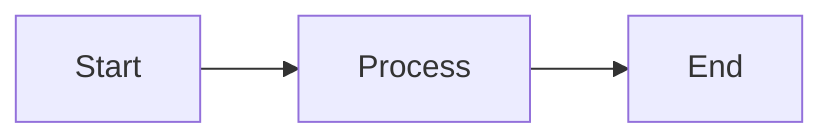
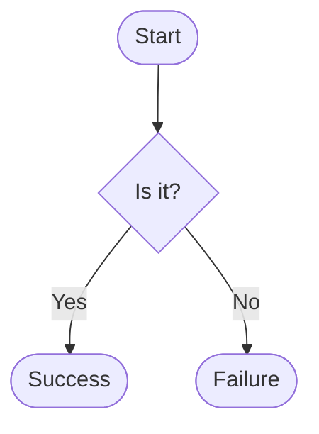
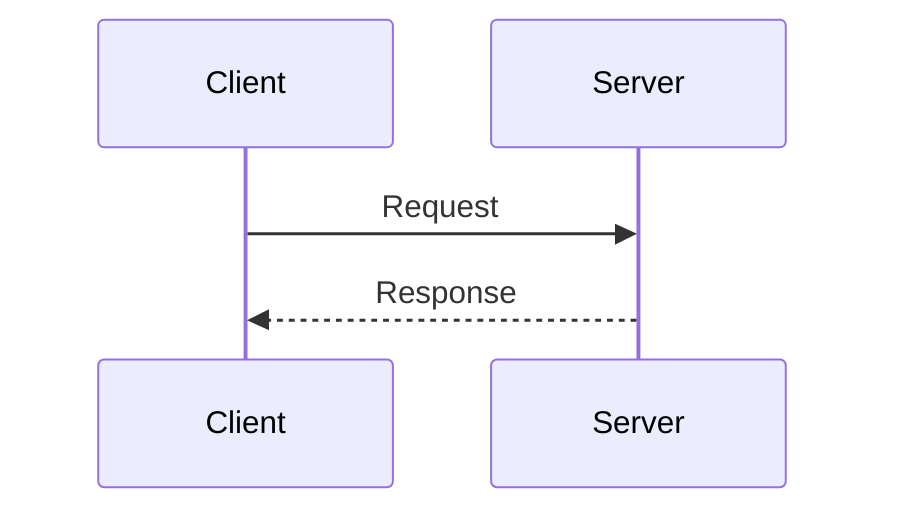
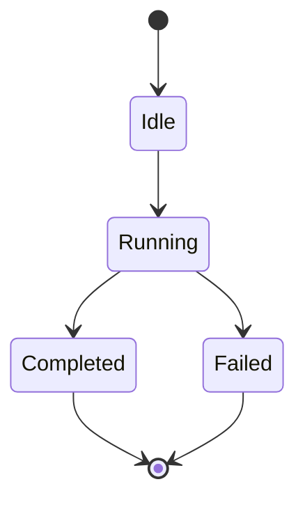
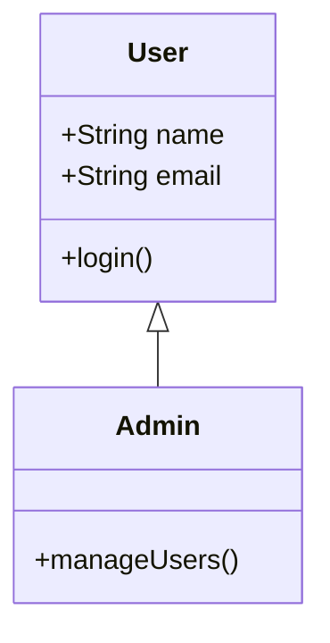
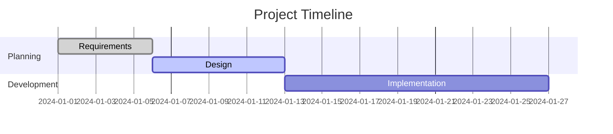
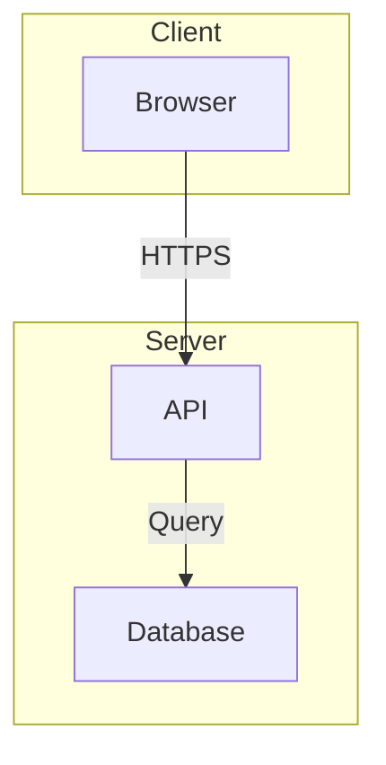
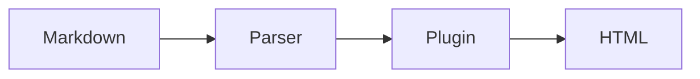

# Mermaid Plugin

Render diagrams and flowcharts with mermaid.js syntax.

## Quick Start

### Add to MDSveX Config

:::tabs
```javascript
// JavaScript
import { mermaidPlugin } from '@goobits/docs-engine/plugins';

export default {
  preprocess: [
    mdsvex({
      remarkPlugins: [
        mermaidPlugin(),
        // ... other plugins
      ],
    }),
  ],
};
```

```typescript
// TypeScript
import { mdsvex } from 'mdsvex';
import { mermaidPlugin } from '@goobits/docs-engine/plugins';

const config = {
  preprocess: [
    mdsvex({
      remarkPlugins: [
        mermaidPlugin(),
        // ... other plugins
      ],
    }),
  ],
};

export default config;
```
:::

### Add Hydrator to Layout

```svelte
<script>
  import { MermaidHydrator } from '@goobits/docs-engine/components';
</script>

<MermaidHydrator />
<slot />
```

### Use in Markdown

````markdown

````

---

## Supported Diagram Types

### Flowchart

````markdown

````

**Result:**



### Sequence Diagram

````markdown

````

**Result:**


### State Diagram

````markdown

````

**Result:**


### Class Diagram

````markdown

````

### Gantt Chart

````markdown

````

---

## Configuration

### Theme

```javascript
mermaidPlugin({
  theme: 'dark'  // or 'default', 'forest', 'neutral'
})
```

### Custom Config

```javascript
mermaidPlugin({
  theme: 'dark',
  flowchart: {
    curve: 'basis'
  },
  sequence: {
    actorMargin: 50
  }
})
```

---

## Examples

### Architecture Diagram

````markdown

````

### Data Flow

````markdown

````

---

## Best Practices

1. **Keep diagrams simple** - Max 10-15 nodes for readability
2. **Use descriptive labels** - Clear, concise text
3. **Group related nodes** - Use subgraphs for organization
4. **Test rendering** - Preview locally before committing

---

## Performance

Mermaid adds ~250KB to bundle. For docs with many diagrams:

- Consider lazy loading
- Use static image exports for simple diagrams
- Limit diagrams per page

---

## Related Documentation

**Prerequisites:** Basic markdown knowledge, understanding of diagram types

**Next Steps:**
- [Diagrams Guide](../guides/diagrams.md) - Visual architecture examples

**Related:**
- [Mermaid.js Documentation](https://mermaid.js.org/) - Complete syntax reference
