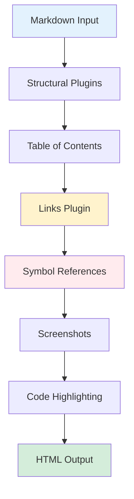
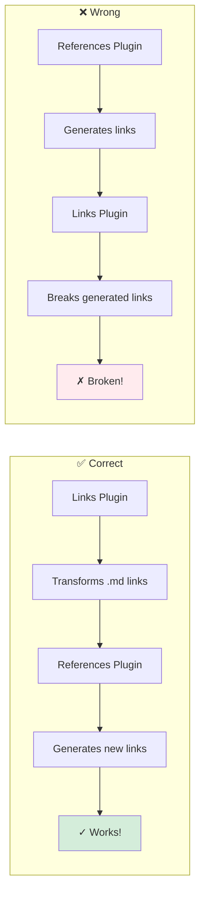

# Plugin Order Guide

Remark plugins execute in the order they're listed. **Order matters!**

> **Warning:** Incorrect plugin order is the #1 cause of broken documentation rendering. This guide shows you the correct order and explains why.

## TOC

## Visual Overview



## Correct Order

```javascript
import { mdsvex } from 'mdsvex';
import remarkMath from 'remark-math';
import {
  filetreePlugin,
  calloutsPlugin,
  collapsePlugin,
  mermaidPlugin,
  tabsPlugin,
  remarkTableOfContents,
  linksPlugin,
  referencePlugin,
  screenshotPlugin,
  katexPlugin,
  codeHighlightPlugin,
} from '@goobits/docs-engine/plugins';

export default {
  preprocess: [
    mdsvex({
      remarkPlugins: [
        // 1. Structural transformations (don't depend on others)
        filetreePlugin(),
        calloutsPlugin(),
        collapsePlugin(),
        mermaidPlugin(),
        tabsPlugin(),

        // 2. Table of contents (needs stable headings)
        remarkTableOfContents(),

        // 3. Links transformation (before references)
        linksPlugin(),

        // 4. Symbol references (needs links transformed)
        referencePlugin(),

        // 5. Screenshots (near end)
        screenshotPlugin(),

        // 6. Math and code highlighting (last)
        remarkMath,
        katexPlugin(),
        codeHighlightPlugin(),
      ],
    }),
  ],
};
```

## Why This Order?

> **Note:** Each section below explains why plugins must run in this specific order.

### 1. Structural Plugins First

Plugins that create new markdown structures should run first:
- `filetreePlugin()` - Transforms code blocks
- `calloutsPlugin()` - Transforms blockquotes
- `collapsePlugin()` - Transforms directive blocks
- `mermaidPlugin()` - Transforms code blocks
- `tabsPlugin()` - Transforms directive blocks

These don't depend on other plugins.

### 2. Table of Contents Early

`remarkTableOfContents()` needs to run before plugins that modify headings or create new ones.

### 3. Links Before References

> **Warning:** This is CRITICAL! Getting this wrong breaks symbol references.

**Critical:** `linksPlugin()` must run **before** `referencePlugin()`.

**Why?**



- `referencePlugin()` generates links (e.g., `{@Symbol}` → `[Symbol](url)`)
- If `linksPlugin()` runs after, it will try to transform these generated links
- This breaks the symbol links

### 4. Screenshots Before Code Highlighting

`screenshotPlugin()` should run before `codeHighlightPlugin()` to ensure screenshot code blocks are processed first.

### 5. Code Highlighting Last

Syntax highlighting should be the final transformation to code blocks. This ensures all other plugins have finished processing code blocks.

## Common Mistakes

### Mistake 1: References Before Links

```javascript
// ❌ WRONG
remarkPlugins: [
  referencePlugin(),  // Runs first
  linksPlugin(),      // Breaks symbol links
]
```

```javascript
// ✅ CORRECT
remarkPlugins: [
  linksPlugin(),
  referencePlugin(),
]
```

### Mistake 2: Code Highlighting Too Early

```javascript
// ❌ WRONG
remarkPlugins: [
  codeHighlightPlugin(),  // Runs first
  filetreePlugin(),       // Won't process highlighted code
]
```

```javascript
// ✅ CORRECT
remarkPlugins: [
  filetreePlugin(),
  codeHighlightPlugin(),  // Runs last
]
```

### Mistake 3: TOC After Content Plugins

```javascript
// ❌ WRONG
remarkPlugins: [
  referencePlugin(),       // Might add headings
  remarkTableOfContents(), // TOC won't include them
]
```

```javascript
// ✅ CORRECT
remarkPlugins: [
  remarkTableOfContents(),
  referencePlugin(),
]
```

## Minimal Configuration

For a basic docs setup:

```javascript
remarkPlugins: [
  calloutsPlugin(),
  tocPlugin(),
  linksPlugin(),
  codeHighlightPlugin(),
]
```

## Full Configuration

For all features:

```javascript
remarkPlugins: [
  // Content structure
  filetreePlugin(),
  calloutsPlugin(),
  collapsePlugin(),
  mermaidPlugin(),
  tabsPlugin(),

  // Navigation
  remarkTableOfContents(),

  // Link processing
  linksPlugin(),

  // Advanced features
  referencePlugin(),
  screenshotPlugin(),

  // Syntax rendering
  remarkMath,
  katexPlugin(),
  codeHighlightPlugin({
    theme: 'dracula',
    showLineNumbers: false
  }),
]
```

## Debugging Plugin Order

If you're experiencing issues:

1. **Check the console** - Plugin errors often indicate order problems
2. **Test incrementally** - Add plugins one at a time
3. **Read plugin docs** - Each plugin doc notes dependencies
4. **Use this guide** - Follow the recommended order above

## Plugin Dependencies

| Plugin | Must Run After | Must Run Before |
|--------|---------------|-----------------|
| `filetreePlugin` | - | `codeHighlightPlugin` |
| `calloutsPlugin` | - | - |
| `collapsePlugin` | - | - |
| `mermaidPlugin` | - | `codeHighlightPlugin` |
| `tabsPlugin` | - | `codeHighlightPlugin` |
| `remarkTableOfContents` | Structural plugins | Content plugins |
| `linksPlugin` | - | `referencePlugin` |
| `referencePlugin` | `linksPlugin` | - |
| `screenshotPlugin` | - | `codeHighlightPlugin` |
| `codeHighlightPlugin` | All other plugins | - |

## Related Documentation

**Prerequisites:** Understanding of remark/rehype plugins

**Next Steps:**
- [Architecture](./architecture.md) - System design
- [Examples](./examples.md) - Complete configurations

**Related:**
- [Getting Started](../getting-started.md) - Basic setup
