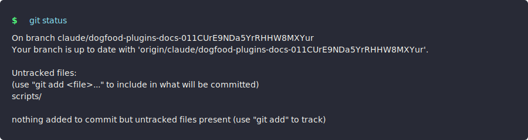

# CLI Screenshots

This directory contains generated CLI screenshot examples used in the documentation.

## Generation

Screenshots are generated using:

```bash
node scripts/generate-cli-screenshots-svg.mjs
```

This creates SVG screenshots with terminal-styled output showing:
- Command prompt with syntax highlighting
- Actual command output
- Themed colors (dracula, monokai, solarized, nord)

## Examples

- `git-status.svg` - Git status command with Dracula theme
- `git-log.svg` - Git log command with Monokai theme
- `ls-plugins.svg` - Directory listing with Solarized theme
- `package-json.svg` - File content display with Dracula theme
- `pnpm-test.svg` - Test results with Dracula theme
- `tsx-generate.svg` - Symbol generation output with Dracula theme

## Format

SVG format is used for:
- Vector graphics (scalable at any resolution)
- Smaller file sizes
- Easy to edit and customize
- Web-native format (no conversion needed)
- Perfect for documentation

## Usage in Documentation

Reference these in markdown:

```markdown

```

Or use in plugin documentation to showcase CLI commands visually.
